# Javascript {ignore}
[toc]

# 第一个JS程序

## 浏览器环境中，代码书写位置

1. 直接书写到页面中的script元素的内部

2. 书写到外部的JS文件，在页面中引用[推荐]

- 代码分离：内容、样式、功能，三者分离，更加容易维护和阅读

- 如果一个script元素引入了一个外部文件，元素里不能书写任何代码

- script元素有一个可选的属性，type，该属性用于指定代码的类型，该属性值是MIME格式

## 语法知识

- 语法语法部分必须都是英文符号

- JS代码由多条语句构成，每个语句用英文分号结束（并非强制）

- JS代码从上到下同步执行

- JS语言大小写敏感

## 认识输出语句

所有的输出语句都不是ES标准

- ``document.write`` 该语句用于将数据输出到页面

- ``alert``  该语句用于将数据用弹框的形式显示到页面

- ``console.log`` 该语句用于将数据显示到控制台

## 认识输入语句

所有的输入语句都不是ES标准

- ``prompt("输入内容")`` 弹出输入框供用户输入

## 认识注释

注释：提供给代码阅读者使用，不参与执行

1. 双斜杠，单行注释``//``

2. 多行注释 ``/* */``

在VScode中：

使用快捷键ctrl + /，可以快速添加和取消单行注销

使用快捷键alt + shirt + a，可以快速添加和取消多行注释

# 数据和数据类型

数据：有用的信息

数据类型：数据的分类

## JS的数据类型

### 原始类型

原始类型：指不可再分的类型

1. 数字类型：number

    直接书写

    > 数字类型可以加上前缀，来表示不同的进制
    > 0：表示8进制
    > 0x：表示16进制
    > 0b：表示2进制

```js
    console.log(0xf);
```

2. 字符串类型：string

**字符串：一个或多个文本**

- 单引号

- 双引号

- `号，叫做模板字符串

书写特殊字符：转译```console.log("hello \'world\'");```

    \n:换行符
    \t:制表符，tab键

3. 布尔类型：boolean

布尔类型：用于表示真或假两种状态

- ``true``：正

- ``false``：假

4. undefined类型

表示未定义，不存在

只有一种数据书写方式：``undefined``

5. null类型

表示空，不存在

**区分某些字符串和长数字**：根据读的方式区分

### 引用类型

引用类型有两种：

- 对象 object

可以认为，对象由多个基本类型组合而成

```js
{
    name："user",
    age:18,
    gender:true //true为男，false为女，
}
```

**属性**：对象的成员

- 函数

## 获取数据类型

在数据前加typeof

> JS的bug（特征）：``typeof null``，得到的是``object``

## 字面量

字面量：直接书写的具体的数据，叫做**字面量**

# 变量

## 什么是变量

变量是一块累存空间，用于保存数据

>计算机：cpu、内存、硬盘、输入输出设备

>内存：存取速度快，数据易丢失

>硬盘：存取速度慢，数据永久保存

>计算机程序的运行，仅与内存打交道

## 如何使用变量

1. 声明（定义）变量

```js
var a;
```

**变量声明后，它的值为undefined**

2. 给变量赋值

    向变量的内存空间中存放数据

- 变量的值是可变的

变量可以被重新赋值，新的值会覆盖原来的值

- 变量的名称

在开发中，凡是要自行命名的位置，叫做标识符

标识符的规范：

1) [必须]只能英文字母、下划线、$开头

2) [必须]其他位置可以出现数字、英文字母、下划线、$

3) [必须]标识符应该做到望文知义

4) [必须]如果有多个单词，使用驼峰命名法

5) [必须]不可以与保留词和关键字重复

>大驼峰：每个单词首字母大写

>小驼峰：除第一个单词外，首字母大写

>目前，使用的标识符都是小驼峰命名法

变量的声明和赋值可以一条语句书写

```js
        var a = 1;
```

**任何可以书写数据的地方都可以放变量**

```js
        var a = 'vs code';
        var b = a;
```

- 若使用一个未声明的变量，会导致错误

例外：使用typeof得到类型时，可以是未声明的变量，得到的结果是undefined

- **JS中存在变量提升**：
    
    所有变量的声明会自动提升到代码的最顶部

    但是这种提升不会超越脚本块

- JS中允许声明多个同名变量

# 变量和类型

原始类型：number、string、boolean、null、undefined

引用类型：object、function

## 在变量值存放对象

1. 通过变量，读取对象的某个属性

当读取的属性不存在（undefined和null）时，会得到undefined

```js
var user = {
    name:'Tom',
    age:18,
    gender:true,
    isVIP:true
};
console.log(user.age,typeof user.age);
console.log(user.password,typeof user.password);
```

2. 通过变量，添加和更改对象中的某个属性

```js
var user = {
    name:'Tom',
    age:18,
    gender:true,
    isVIP:true
};
user.password = '123456';
user.address = {
    country:'China',
    city:'合肥'
};
user.isVIP = false;
console.log(user.isVIP,user);
```

3. 删除属性

```js
var user = {
    name:'Tom',
    age:18,
    gender:true,
    isVIP:true
};
delete user.dender;
```

4. 属性表达式

给属性赋值，或读取属性时，可以使用下面的格式读取

对象["属性"]

```js
var user = {
    name:'Tom',
    age:18,
    gender:true,
    isVIP:true
};
console.log(user['name']);
```

- 某些属性名中包含特殊字符

实际上，JS对属性名的命名要求并不严格，属性可以使任何形式的名字

**属性的名字只能是字符串，如果你书写的是数字，会自动转换为字符串**

## 全局对象

JS大部分的宿主环境，都会提供一个特殊的对象，该对象可以直接在JS代码中访问，该对象叫做**全局对象**

浏览器中，全局对象为window，表示整个窗口

全局对象中的所有属性，可以直接使用，而不需要写上全局对象名

```js
alert('请输入用户名');
```

**开发者定义的所有变量，实际上，会成为window对象的属性**

**如果变量没有被赋值，则该变量不会覆盖window对象上的同名属性**

```js
var a;
var console;
console.log(window);//a成为了window对象的属性，因为，window之前没有属性a,console未被覆盖
```

# 引用类型

```js
//a指向该对象
//a持有该对象的引用
        var a = {
            name: 'Tom',
            age: 18,
            gender: true,
            isVIP: true
        }//出现对象字面量的位置，会开辟一块内存空间，用于存放对象的内容
        //a和b指向同一个对象
        //a和b持有相同的引用
        var b = a;
        b.age = 20;//b改变了该变量的属性
        console.log(a.age,b.age)//20 20 
```
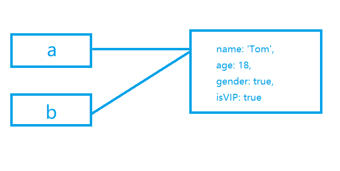

- **原始类型的变量，存放的是具体的值**

- **引用类型的变量，存放的是内存地址**

- **凡是出现对象字面量的位置，都一定在内存中出现一个新的对象**

> 扩展知识：JS中的垃圾回收

    JS引擎的垃圾回收器，会定期的发现内存中无法访问到的对象，该对象称之为垃圾，JS引擎会在合适的时间将其占用的内存清除

**补充：**在JS中，变量在使用时可以不写var，不写var直接赋值，相当于window的某个属性直接赋值

# 运算符概述

## 操作符和操作数

操作符：运算符，参与运算的符号

操作数：参与运算的数据，也称之为“元”

操作符不一定只有一个符号

```js
()
++
--
==
===
```

**操作符出现在不同的地方，可能具有不同的含义**

```js
1+2
+1
```

目前接触的操作符

1. ```=```赋值符号，将右边的数据赋值给左边

2. ```.```访问符号，通常用于访问对象的属性

3. ```[]```同```.```访问符号，通常用于访问对象的属性

4. ```()``` 函数调用符

## 运算符的分类

操作数数量区分：

- 一元（目）运算符:```()``` ```.```

- 二元（目）运算符:```+``` ```-``` ```*``` ```/``` ```%``` ```=```

- 三元（目）运算符:```?``` ```:```


功能区分：

- 算术运算符（数学）

- 比较运算符

- 逻辑运算符

- 位运算符

- 其他

## 表达式

表达式 = 操作数 + 操作符

每个表达式都有一个运算结果，该结果叫做**返回值**，返回值的类型叫做**返回类型**

**所有的表达式都可以当做数据使用**

目前学习的运算符的返回值和类型

1. ```=``` 该表达式，返回赋值的结果

2. ```.``` 属性访问表达式，返回访问的值

3. ```[]``` 同```.```属性访问表达式，返回访问的值

4. ```()``` 函数调用表达式，返回的结果取决于函数的运行

5. 如果是一个声明加赋值的表达式，返回结果为```undefined```

- ```console.log```函数调用的返回结果为```undefined```

    > chrome浏览器控制台的环境是REPL环境

    > REPL：Read Eval Print Loop，读-执行-打印-循环

    > 当直接在控制台书写代码时，出了运行代码以外，还会输出该表达式的返回值 

# 算术运算符

数字运算符

1. ```+ - * /```四则运算符

2. ```+ -```正负值

3. ```%``` 求余

4. ```++ --```递增递减

5. ```**```指数

## 细节 

1. JS语言中，数字运算是不精确的

2. 除数为0时，且被除数不为0，得到的值为+-infinity（无穷）
    如果被除数为0，得到结果为NaN（Not a Number,非数字，类型为number）

> typeof函数返回类型为string
>isNaN函数，该函数用于判断一个数据是否为NaN，返回boolean值
>isFinite函数，该函数用于判断一个数据是否有限的，返回boolean值，NaN返回的是false

3. 求余，有的教程称为求模

    余数的符号，与被除数相同

## 其他类型使用的运算符

1. 除加号以外的算术运算符

    将原始类型转换为数字类型(自动完成转换)，然后进行计算

    - boolean：true >>> 1 ,false >>> 0

    - string: 如果字符串内部是一个正确的数字，直接变为数字

        如果字符串内部是一个非数字，则是NaN

        能识别infinity
        如果字符串是一个空字符串（没有任何内容），转换为0，如果有内容，转换为NaN

    > NaN虽然是数字，但NaN与任何数字进行运算都为NaN

    - null:null >>> 0

    - undefined: undefined >>> NaN

    - 对象类型：{} >>> [object object] >>> NaN

        将对象类型先转换为字符串类型，然后再将该字符串转换为数字类型

2. 加号运算符

- 加号一边有字符串，含义变为字符串拼接

    将另一边的其他类型，转换为字符串

    1) 数字 >>> 数字字符串

    2) boolean >>> bololean字符串

    3) null >>> 字符串'null'

    4) undefined >>> 字符串"undefined"

    5) 对象 >>> 字符串"[object object]"

- 加号两边都没有字符串，但一边有对象，将对象转换为字符串，按照上面规则拼接

```js
var a;
a = 'abc' + 1;
console.log(a);//'abc1'
```

# 自增和自减

## 基本功能

++：将某个变量的值自加1

--：将某个变量的值自减1

## 细节

### 自增自减表达式

x++：将变量x自增1，得到的表达式的值是自增之前的

++x：将变量x自增1，得到的表达式的值是自增之后的

x--：将变量x自减1，得到的表达式的值是自减之前的

--x：将变量x自减1，得到的表达式的值是自减之后的

### 优先级

从高到低依次是：

1. ```++ --```

2. ```* / %```

3. ```+ - ```

优先级的运算细节

1. 从左到右依次查看

2. 如果遇到操作数，将数据的值直接取出

3. 如果遇到相邻的两个运算符，并且左边的运算符优先级大于等于右边的运算符，则直接运行左边的运算符

# 比较运算符

大小比较：```>``` ```<``` ```>=``` ```<=```

相等比较：```==``` ```!=``` ```===``` ```!==```

**比较运算符的返回类型：boolean**

**算术运算符的优先级高于比较运算符**

## 大小比较


**细节**

1. 两个字符串比较大小，比较的是字符串的字符编码（ASC码）

2. 如果一个不是字符串，并且两个都是原始类型

3. 如果其中一个是对象，将对象转换为原始类型后，按照规则1或规则2进行比较

## 相等比较

### ==和!=（相等比较、不相等比较）

==：比较两个数据是否相等

!=：比较两个数据是否不相等

**细节**

1. 两端的类型相同，直接比较两个数据本身是否相同（两个对象比较的是地址，不是内容）

2. 两端的类型不同

    - null 和 undefined，它们之间相等，和其他原始类型比较，则不相等

    ```js
            console.log(null == undefined);//true
            console.log(null != undefined);//false
            console.log(null == 0);//false
            console.log(undefined == 0);//false
    ```
    - 其他原始类型，比较时先转化为数字，再进行比较

    ```js
            console.log('1' == 1);//true
            console.log(true == 1);//true
    ```

    - NaN与任何数字比较，都是false，包括自身

    - infinity和 -infinity，只能和自身相等

    - 引用类型比较时，要先转化为原始类型后，再进行比较

    ```js
            console.log({} == 0);//false
    ```

**由于相等比较和不想等比较，对于不同类型的数据比较违反直觉，因此我们通常不使用这种方式，而是使用更加接近直觉的严格相等和严格不相等**

## === 和 !== （严格相等 、严格不相等）

===:两端的数据和类型必须相等

!==:两端的数据或类型不相同

1. 两端类型相同，规则和相等比较一致

2. 两端类型不同，直接false

    - NaN与任何数字比较，都是false，包括自身

    - infinity和 -infinity，只能和自身相等

# 逻辑运算符

布尔运算符

## 与 ```&&```

书写方式：表达式1 && 表达式2

1. 将表达式1 进行 boolean 判定

一下数据均判定为 false

    - null

    - undefined

    - false
    
    - NaN

    - ''

    - 0

其他数据均为真

2. 如果表达式1的判定为假，则直接返回表达式1，而不执行表达式2，否则返回表达式2的结果 

## 或 ```||```

写法：表达式1 || 表达式2

1.  将表达式1 进行 boolean 判定

2. 如果表示式1为真，直接返回表达式1的结果，不运行表达式2;否则，返回表达式2

## 非 ```!```

写法：!数据

一元运算符

取反，非运算符一定返回boolean值

# 三目运算符

书写方式：表达式1 ? 表达式2 ：表达式3

1. 对表达式1进行boolean判定

2. 如果判定结果为真，返回表达式2的结果，否则返回表达式3的结果

# 运算符补充

## 模板字符串

```''``` 
```""``` 
``` ` ```
``` ${}```

## 类型转换不会影响原本的数据

```js
        var x = '1';
        var y = x * 2;
        console.log(y,x,typeof x);//2  '1'  string
```

## 复合的赋值和运算符

```+=```

x = x + 1   >>>   x += 3

```-=```

x = x - 1   >>>  x -= 1

```/=```

x = x / 2   >>>  x /= 2

```*=```

x = x * 2   >>>  x *= 2

```%=```

x = x % 2   >>>  x %= 2

```**=```

x = x ** 2   >>>  x **= 2

## void运算符

一元运算符

写法：

1. 普通写法  ```void 表达式```

2. 函数写法  ```void(参数)```

运行表达式，返回undefined

## typeof运算符

一元运算符

写法：

1. 普通写法  ```typeof 表达式```

2. 函数写法  ```typeof(参数)```

## 逗号运算符

写法：表达式1，表达式2

依次运行两个表达式，返回最后一个表达式的返回值

逗号运算符的优先级比赋值符号更低

# 位运算符

将一个整数的二进制格式进行运算

JS中，如果对一个数据进行位运算，他首先会将其转换为一个整数，并且按照32位的整数二进制进行排列

- 举例：

    ```js
    2.3  ->  2 -> 0000 0000 0000 0000 0000 0000 0000 0010
    NaN -> 0
    Infinity -> 0
    -Inifinity -> 0
    ```

第一个 0 为正负，1位负数，0为正数

## 位与运算 ```&```

写法：整数1 & 整数2

将两个整数每一位进行比较，如果都为1，结果为1，否则结果为0

```js
        //  0000 0000 0000 0000 0000 0000 0000 0100
        //  0000 0000 0000 0000 0000 0000 0000 0101
        //  =
        //  0000 0000 0000 0000 0000 0000 0000 0100
        // 相同位上都为1，则结果的该位上也为1，否则为0
        console.log(4 & 5);//0
```

## 位或运算 ```|```

写法： 整数1 | 整数2

将两个整数每一位进行比较，如果有一个为1，结果为1，否则结果为0

```js
        //  0000 0000 0000 0000 0000 0000 0000 0100
        //  0000 0000 0000 0000 0000 0000 0000 0101
        //  =
        //  0000 0000 0000 0000 0000 0000 0000 0101
        // 相同位上有一个为1，则结果的该位上也为1，否则为0
        console.log(4 | 5);//0
```

## 否运算 ```~```

写法：~整数

将该整数按位取反

**负数的存储方式**

十进制数：-1

真码：```1000 0000 0000 0000 0000 0000 0000 0001```

取反

反码：```1111 1111 1111 1111 1111 1111 1111 1110```

补码：```1111 1111 1111 1111 1111 1111 1111 1111``` 反码加1，最终的储存方式

取反的快速运算：```- x - 1```

```js
    5 >>> -5-1 >>> -6
```

js中最快速取整的方式：

```js
console.log(~~3.1415926);// ~~3.1415926 >>> ~~3 >>> ~-4 >>> 3
```

## 异或运算```^```

写法：数字1 ^ 数字2

将数字1和数字2按位比较，不同取1，相同取0

```js
        //  0000 0000 0000 0000 0000 0000 0000 0100
        //  0000 0000 0000 0000 0000 0000 0000 0101
        //  =
        //  0000 0000 0000 0000 0000 0000 0000 0001
        // 相同位上不同取1，否则为0
        console.log(4 ^ 5);//1
```

## 应用场景

位的叠加

```js
        //保存所有可能的权限
        var perm ={
            read:1,//读权限 0001
            write:2,//写权限 0010
            create:4//创建权限 0100
        }
        //变量p中保存可读可写可添加
        var p = perm.read | perm.write | perm.create;

        //判断权限：p中是否有可读权限
        p & perm.read === perm.read?console.log('可读'):console.log('不可读');
        p & perm.write === perm.write?console.log('可写'):console.log('不可写');
        p & perm.create === perm.create?console.log('可写'):console.log('不可写');

        //去掉可读权限
        p = p ^ perm.read; 

        console.log(p);
```

## 位移运算 ```<<``` ```>>``` ```>>>```

写法：数字1 << 数字2  数字1 >> 数字2

将数字1的二进制（除符号之外，左移动数字2的次数）

```js
        // 0000 0000 0000 0000 0000 0000 0000 0011
        // 0000 0000 0000 0000 0000 0000 0000 0001
        // <<
        // 0000 0000 0000 0000 0000 0000 0000 0110
        // 将数字1的二进制（除符号之外，左移动数字2的次数）
        console.log(3 << 1);//6
```


**左位移**

z = x << y

z = x * 2^y

**右位移**

z = x >> y

z =(x / 2^y)

**全右位移**

符号位也会位移

# 求模和求余

%：求余，rem

x % y

求余：x rem y  >>> x - n*y,n表示商取整，向零取整

求模：x mod y  >>> x - n*y,n表示商取整，向下取整

**余数和被除数的符号相同**


# 流程图

一套标准的图形，用于描述程序的逻辑

通常流程图分析程序的流程x - n*y,n表示商取整

## 在markdown中画流程图

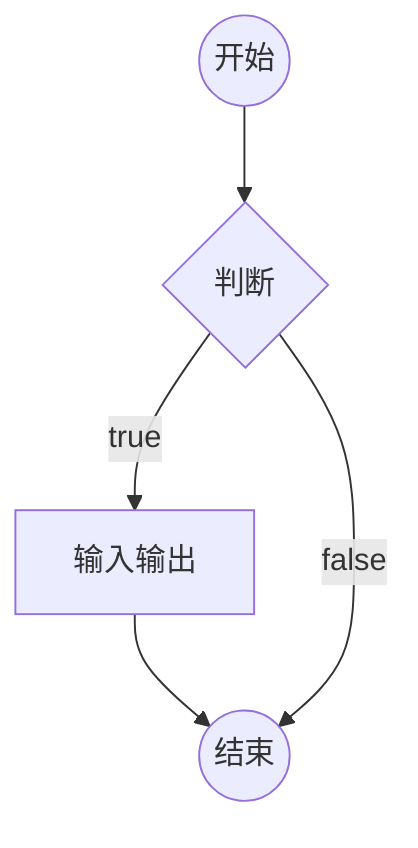

# if判断

```js
if(条件1){
    //代码块
}
else if(条件2){
    //代码块
}
else if(条件3){
    //代码块
}
else{
    //代码块
}
```

1. 如果某个条件满足，则直接忽略后面的所有条件
   
2. else if可以有多个（包含0个）
   
3. else可以有1或0个
   
4. else可以换行，也可以不换行

5. 如果代码块只有一条语句，可以省略花括号[不推荐]

6. if只能出现1次

## 补充

- 用户输入

```js
    //  等待用户操作（确定、取消），将用户操作的结果保存到变量result中
    var result = prompt('请输入');
    console.log(result);
```

该表达式返回的结果：
1. null：表示用户点击了取消

2. 用户输入的字符串：表示用户点击了确定，得到用户输入的结果

返回类型：null 或 字符串

将字符串转换成数字：+字符串

- 得到一个随机数

``Math.random()``该表达式返回一个0~1之间的随机数字（无法取到1）


```js
    //用户输入体重、身高、性别
    var height = +prompt('请输入身高（cm）');
    var weight = +prompt('请输入体重（kg）');
    var gender = prompt('请输入性别（男，女）');
    //判断是否输入有误
    if (isNaN(height) || isNaN(weight) || gender !== '男' && gender !== '女') {
        console.log('输入有误') ;
    } else {
        var standerWeight
        //通过性别计算标准体重
        if (gender === "男") {
            standerWeight = (height - 80) * 0.7;
        } else {
            standerWeight = (height - 70) * 0.6;
        }
        //通过标准体重计算是否正常
        if(weight < standerWeight*0.9){
            console.log('你的身体偏瘦，请加强营养！')
        }else if(weight > standerWeight*1.1){
            console.log('你的身体偏胖，请加强锻炼！')
        }else{
            console.log('你的体重正常，请继续保持！')
        }
    }
```

# switch开关

switch的语法始终可以用if结构代替

```js
switch(表达式){
    case 数据1;
        代码块
    case 数据2;
        代码块
    //....
    default:
        代码块
}
```

1. 计算表达式的返回值，依次和case后面的数据进行严格相等的比较，如果某个相等，停止比较，然后运行其内部的代码块，再然后，依次运行后面的所有代码块
   
2. 在case分支的内部，使用break语句，可以立即停止switch结构

3. default表示前面所有的case都不匹配时运行，可以省略

```js
    var x = 19;
    switch (x) {
        case 1:
            console.log(1);
        case 2:
            console.log('2');
        case 19://判断相等
            console.log('19');//运行
        case 10:
            console.log('10');//运行
        case 80:
            console.log('80');//运行
        default:
            console.log('end');//运行
    }
```

# 循环

重复的运行一段代码

JS支持三种循环结构：while循环、do-while循环、for循环

## while循环

```js
while(条件){
    代码块(循环体)
}
```

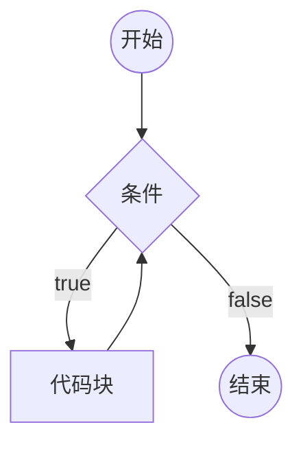
```js
        var i =0;
        while(i < 100 ){
            console.log('1');
            i++;
        }
```

## do-while循环

```js
do{
    循环体
}while(条件)
```

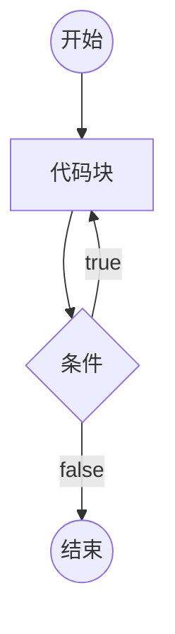

## for循环

```js
for( 初始化表达式 ; 条件 ; 条件改变表达式 ){
    循环体
}
```
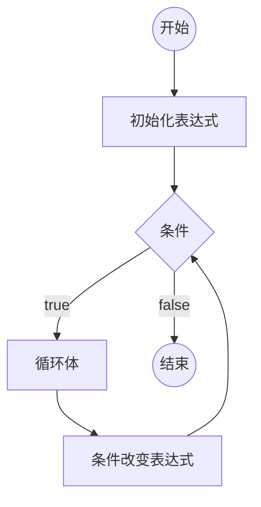

```js
        for(var i =0; i<100; i++){
            if(i % 2 == 1){
            console.log(i)
            }
        }
```

## 循环中的关键字

循环控制语句

- break 跳出循环，强制结束最近的父级for循环

- continue 停止当前循环，进入下一次循环


# 循环应用

## 累计问题

举例1：将1-100的所有数字相加之和

```js
        var sum = 0;
        for (var i = 0; i <= 100; i++) {
            sum = sum + i;
        }
        console.log(sum)
```

举例2：将1-10的所有数字相乘

```js
        var sum = 1;
        for (var i = 1; i <= 10; i++) {
            sum = sum * i;
        }
        console.log(sum)
```

举例3：1-100所有奇数相加

```js
        var sum = 0;
        for (var i = 1; i <= 100; i++) {
            if(i % 2 != 0){
                sum = sum + i;
            }
        }
        console.log(sum)
```

## 查找

举例1：135-145之间是否存在能整除26的数字

```js
        for (var i = 135; i <= 145; i++) {
            if(i % 26 == 0){
                console.log('存在',i);
                break;
            }
            if(i == 145 && i % 26 != 0){
                console.log('不存在')
            }
        }
```

举例2：打印135-185之间能被26整除的第一个数字，如果不存在，输出不存在

```js
        for (var i = 135; i <= 185; i++) {
            if(i % 26 == 0){
                console.log('存在',i);
                break;
            }
            if(i == 185 && i % 26 != 0){
                console.log('不存在')
            }
        }
```

举例3：判断一个数是否是素数

```js
        var j= + prompt('输入一个大于2的数字');
        for(var i = 2; i<j; i++){
            if(j % i == 0){
                console.log(j+'不是素数');
                break;
            }
            if(i == j-1 && j % (j-1) != 0){
                console.log(j+'是素数');
            }
        }
```

## 嵌套循环

举例1：打印1-100之间的素数

```js
        for(var i =3; i<=100; i++){
            for(var j = 2; j<i; j++){
                if(i % j === 0){
                    break;
                }
                if(i % j != 0 && j == (i-1)){
                    console.log(i)
                }
            }
        }
```

# 数组

数组用于存放多个数据

## 创建一个数组

1. ``new Arrary(长度)``

长度，数组里面的数据总数，长度为一个非负整数

``new Array(数据,数据，数据.....)``

创建一个数组，并初始化其每一项的值

数据项：数组其中的一项数据

2. ``[数据，数据，数据，数据]``

创建一个数据，并初始化其每一项的值

## 认识数组的本质

数组的本质是一个对象

```js
        var arr = [];
        console.log(typeof arr)//object
```

- length属性：数组的长度，会自动变化，值为最大数值加1

- 数字字符串属性：叫做下标，也叫索引，相当于数组中每个数据的编号，下标从0开始

连续下标的取值范围：``0 -->  length - 1``

实际开发中，不要给length赋值，减小length可能会截断数组

## 下标

通常情况下，下标是连续的

下标不连续的数组，叫做松散数组

## 数组的常见从操作

```js
        var arr = [12,0,5,43,'adsasd'];
        arr[5] = 'abc';
        arr[arr.length] = 'bcd';
        console.log(arr.length,arr);
```

## 添加数组项

- ``数组[长度] = 数据``：向数组的随后一项后面再添加一项数据

- ``数组.push``:向数组的随后一项后面再添加一项数据

```js
            var arr = [12,0,5,43,'adsasd'];
            arr.push ({
                abc:1,
                bcd:'a'
            });
            console.log(arr.length,arr);
```

- ``数组.unshift``：向数组起始位置添加一个数据，会导致数组每一项的下标向后移动

```js
    var arr = [12,0,5,43,'adsasd'];
    arr.unshift ('daidi');
    console.log(arr.length,arr);
```

**``push``和``unshift``可以添加多个数据**

- ``数组.splice(下标,0,添加的数据)``：从下标位置后面，删除0个数据，再添加上一个或多个数据，如果下标超过范围，则按照范围的边界进行处理

``push``、``unshift``、``splice``可与添加多个数据

### 删除数据

- ``delete 数组[下标]``:这种做法不会导致数组的其他属性发生变化，因此，该做法会导致产生疏松数组，不推荐使用该方法

```js
            var arr = [1,2,3,4,5];
            delete arr[1]
            console.log(arr.length,arr);//5  [1,empty,3,4,5]  
```

- ``数组.pop()``：删除数组的最后一项，该表达式返回最后一项的数据

```js
            var arr = [1,2,3,4,5];
             var arrPop = arr.pop();
            console.log(arr.length,arr,arrPop);//4  [1,2,3,4]  5
```

- ``数组.shift()``：删除数组第一项，该表达式返回第一项的数据

```js
            var arr = [1,2,3,4,5];
             var arrShift= arr.shift();
            console.log(arr.length,arr,arrShift);//4  [2,3,4,5]  1
```

- ``数据.splice(下标，数量，添加的数据)``：从下标位置后面，删除0个数据，再添加上一个或多个数据，如果下标超过范围，则按照范围的边界进行处理。返回一个新数组，保存被删除的数据，改变原数组

```js
            var arr = [1,2,3,4,5];
             var arrSplice= arr.splice(2,1);
            console.log(arr.length,arr,arrSplice,typeof arrSplice);//4 [1,2,3,5]  [3]
```

### 其他操作

- ``数组.slice(起始位置下标,结束位置下标)``:从起始位置到结束位置之间的数据删除，**结束下标取不到**，返回一个新数组，保存被删除的数据，原来数组不变

``下标是负数的话，则从数组的末尾开始计算，如果不写第二个参数（结束下标），则直接删到最后一个数据

```js
            var arr = [1,2,3,4,5,6];
             var arrSlice= arr.slice(2,3);
            console.log(arr.length,arr,arrSlice,typeof arrSlice);//6 [1,2,3,4,5,6]  [3] object
```

- 数组清空

``数组.splice(0,数组.length)``

``数组.length = 0;``

- 查找数组中某一项的下标
  
``数组.indexOf(数据)``：从数组中依次查找对应的数据，查找时使用严格相等进行比较，找到第一个匹配的下标，返回

```js
        var arr = [1,2,3,4,5,6];
         var arrIndexOf= arr.indexOf(2);
        console.log(arrIndexOf );//1
```

``数组.lastIndexOf(数据)``：同indexOf，只是查找的是最后一个匹配的下标

- ``数组.fill``

    ``数组.fill(数据)``：将数组的所有项，填充为指定的数据

    ``数组.fill(数据,开始下标)``：将数组从开始下标起，到数组的末尾，填充为指定的数据

     ``数组.fill(数据,开始下标,结束下标)``：将数组从开始下标起，到结束下标（取不到），填充为指定的数据

```js
        var arr = [, , , , 5];
        arr.fill('a',0,4)
        console.log(arr);//['a','a' ,'a' ,'a' , 5]
```

- ``数组.join(分隔符)`` ：将数组的每一项拿出来，用分隔符拼接
  
```js
        var arr = [1, 2, 3, 4, 5];
        var str = arr.join(',')
        console.log(str);//1,2,3,4,5
```

- ``数组1.concat(数组2)``：将数组2的所有元素拼接到数组1的末尾，返回一个新的数组,不会改变原数组

```js
        var arr1 = [1, 2, 3, 4, 5];
        var arr2 = [6,7];
        var arr3 = arr1.concat(arr2)
        console.log(arr3);//[1, 2, 3, 4, 5, 6, 7]
```

## 语法补充

### in关键字

```js
        var obj = {
            a:'sad',
            b:'dasd',
            c:'dasff',
            d:'pdai'
        }
    console.log('b' in obj )
```

### for-in循环

```js
for(var pro in 对象){
    //循环体
}
```

取出对象的所有属性名，每次循环将其中一个属性名赋值给变量prop，运行循环体

```js
        var obj = {
            a:'sad',
            b:'dasd',
            c:'dasff',
            d:'pdai'
        }
        for(var prop in obj){
            console.log(prop)//a b c d
        }
```

**for-in循环遍历的是属性名，而for循环遍历的是下标（index）**


# 数组应用

1. 让用户依次输入数组的长度一节每一项的值，最后输出该数组
   
```js
        var len = +prompt('请输入该数组长度');
        // 提示用户输入数组的长度
        if (isNaN(len) || len <= 0) {//判断用户输入是否有误
            console.log('输入有误')
        } else {
            //输入无误，创建数组
            var arr = new Array(len);
            //遍历len，提示用户输入数组的每一项
            for (var i = 0; i < len; i++) {
                arr[i] = prompt('请输入该数组的第' + (i + 1) + '项');
            }
            console.log(arr);
        }
```

2. 初始化一个数组，然后输出数组中所有的奇数

```js
        var arr = [13,12,3,123,14,7,5,4,23,,78,45];
        //for-in循环，遍历数组中的每一项
        for(var index in arr){
            //判断该项是否是奇数
            if(arr[index] % 2 == 1){
                console.log(arr[index]);
            }
        }
```

3. 初始化一个数组，然后输出这个数组中所有的素数

```js
        var arr = [13, 12, 2, 3, 123, 14, 7, 5, 4, 23, , 78, 45, 29];
        //for-in循环，遍历数组中的每一项
        for (var index in arr) {
            var isFind = false;
            for (var i = 2; i < arr[index]; i++) {
                if (arr[index] % i == 0) {//判断该项是否是素数
                    //是素数，结束当前循环，检查下一项
                    isFind = true;
                    break;
                }
            }
            if (!isFind && arr[index] >= 2) {
                    //判断不是素数，输出该项
                    console.log(arr[index]);
                }
        }
```

3. 斐波拉契数列：1 1 2 3 5 8 13 21 34...，让用户输入斐波拉契数列的长度，并打印该数列

```js
        var len = +prompt('请输入斐波拉契数列的长度');
        if (isNaN(len) || len <= 0) {
            console.log('输入有误');
        } else {
            var arr = new Array(len);
            if (len == 1 || len == 2) {//判断前两项
                for (var i = 0; i < len; i++) {
                    arr[i] = 1;
                }
            } else {
                arr[0] = 1;
                arr[1] = 1;
                for (var i = 2; i < len; i++) {
                    //斐波拉契数列规律
                    arr[i] = arr[i - 1] + arr[i - 2];
                }
            }
            console.log(arr);
        }
```

4. 定义一个数组，数组的每一项是一个用户对象，用户对象中包含账号和密码，随意初始化一些对象放入数组中，然后提示用户输入账号和密码，判断是否登陆成功

```js
        var user = [
            { loginId: 'a1', loginPwd: 'a111' },
            { loginId: 'a2', loginPwd: 'a222' },
            { loginId: 'a3', loginPwd: 'a333' },
            { loginId: 'a4', loginPwd: 'a444' },
            { loginId: 'a5', loginPwd: 'a555' },
            { loginId: 'a6', loginPwd: 'a666' },
            { loginId: 'a7', loginPwd: 'a777' },
            { loginId: 'a8', loginPwd: 'a888' },
            { loginId: 'a9', loginPwd: 'a999' },
            { loginId: 'a10', loginPwd: 'a101010' },
            { loginId: 'a11', loginPwd: 'a111111' },
        ];

        //用户输入账号和密码

        var loginId = prompt('请输入账号');
        var loginPwd = prompt('请输入密码');

        //查找
        var isFind = false;
        for (var i = 0; i < user.length; i++) {
            var userId = user[i];
            if (userId.loginId === loginId && userId.loginPwd === loginPwd) {
                isFind = true;
                break;
            }
        }
        if (isFind) {
            console.log('登录成功！')
        }else{
            console.log('登录失败！')
        }
```

5. 初始化一个5*5的二维数组，数组的每一项是一个数字，计算对角线之和

```js
        var arr = [
            [4, 3, 8, 5, 6],
            [4, 5, 7, 3, 8],
            [3, 5, 1, 5, 7],
            [7, 6, 4, 9, 6],
            [6, 2, 8, 5, 9]
        ]
        var sum = 0;
        for(var i = 0;i<arr.length; i++){//遍历父级数组
            for(var j =0 ;j<arr[i].length;j++){//遍历子级数组
                if(i ==j || i+j == (arr.length-1)){//判断是否在对角线上
                    sum += arr[i][j];
                }
            }
        }
        console.log(sum)
```

6. 初始化一个数字数组，对该数组进行升序排序，随后输出结果
   
```js
        var arr = [3, 9, 10, 5, 7, 4, 8,6,5,1,4];
        for (var i = 1; i < arr.length; i++) {
            //第i次排序，冒泡排序
            for(var j =0;j<arr.length-i;j++){
                //比较j和j+1两个位置的数字
                if(arr[j]>arr[j+1]){//数值互换
                    var temp = arr[j];
                    arr[j] = arr[j+1];
                    arr[j+1] =temp;
                }
                
            }
        }    
        console.log(arr)    
```

7. 有一个数组，存放了一些数字，找出出现频率最高的数字

```js
        var arr = [2, 4, 5, 1, 4, 2, 5, 6, 3, 2, 6, 7, 3, 2];
        //输出：2出现次数最高，出现了4次
        var obj = {}
        for (var i = 0; i < arr.length; i++) {
            //记录每个数字出现的次数
            var n = arr[i];
            if (obj[n]) {//判断是否出现过该数字
                obj[n] += 1;
            } else {
                obj[n] = 1;
            }
        }
        //遍历该对象，并记录下最大得属性值和最大属性值的属性名
        var idName;
        var number = 0;
        for (var prop in obj) {
            if(obj[prop] >number){
                idName = prop;
                number = obj[prop];
            }
        }
        console.log('出现最多的数字是'+idName+'，一共出现了'+number+'次')
```

# 函数语法

重复代码：让程序难以维护

函数主要用于减少重复代码

## 创建（定义、声明）函数

```js
function 函数名(){
    函数体
}
```

函数体的代码不会直接运行，必须手动调用函数，才能运行其中的代码

## 调用函数

运行函数

```js
函数名();
```

## 函数提升

**通过字面量声明的函数，会提升到脚本块的顶部**

**通过字面量声明的函数，会成为全局对象的属性**

## 其他特点

通过typeof 函数名，得到的结果是'function'

函数内部生命的变量：

1. **如果不使用var声明，和全局变量一致，表示给全局对象添加属性**

2. **如果使用var声明，变量提升到所在函数的顶部，函数外部不可使用该变量**

**函数值声明的变量，只能在函数内使用**

## 参数

函数运行的未知条件，需要调用者告知的数据

```js
function 函数名 (参数1,参数2) {

}
函数名(参数)
```

如果没有传入实参，则形参为undefined

## 返回值

函数运行后，得到的结果，调用函数时，调用表达式的值

return 会直接结束整个函数的运行

return后面如果不跟任何数据，返回undefined

如果函数值没有书写return，会在函数最后自动写上return（部分函数会返回undefined的原因）
 
## 文档注释

```js
/**
 * 
 * @param {number} a 
 * @param {number} b 
 * @returns boolean
 */
 function sum(a, b) {
     return a + b;
 }
 sum
```
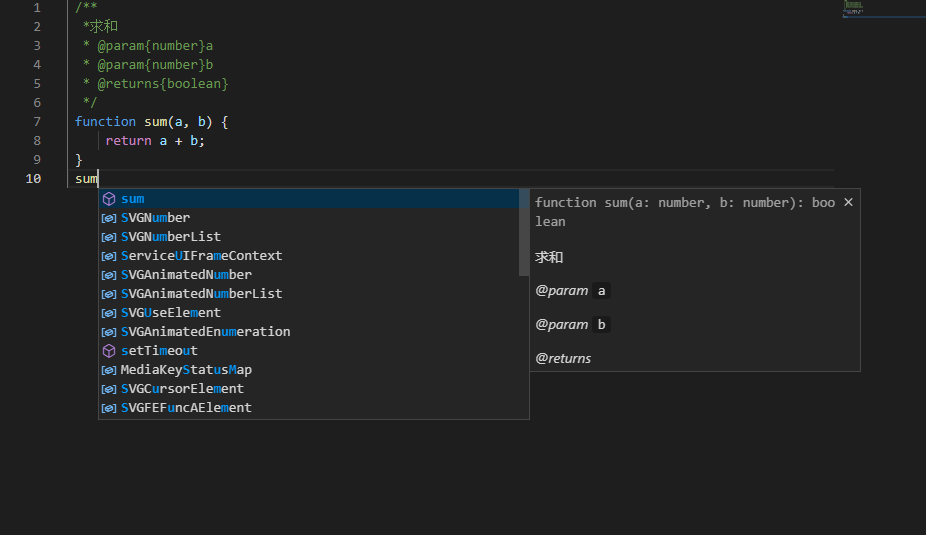

## 函数练习

哥德巴赫猜想：任何一个大于2的偶数，都可以写成两个质数之和

```js
/**
 * 判断一个数是否是素数
 * @param {number} n 
 * @returns boolean
 */
function isPrime(n) {
    if (n < 2) {
        return false;
    }
    for (var i = 2; i < n; i++) {
        if (n % i === 0) {
            return false;
        }
    }
    return true;
}


function begin() {
    var num = + prompt('请输入一个大于2的偶数')
    if (isNaN(num) || num <= 2 || num % 2 === 1) {
        console.log('输入有误！')
        return;
    }
    for (var i = 2; i < num - 2; i++) {
        var j = num - i;
        if (isPrime(i) && isPrime(j)) {
            console.log(num+"="+i+"+"+j)
            // return;                  
        }
    }
}
begin()
```


# 作用域和闭包

## 作用域

作用域表示一个代码区域，也表示一个运行环境

js中有两种作用域

1. 全局作用域

直接在脚本中书写的代码

在全局中声明的变量会被提升到脚本块的顶部，并且会成为全局对象的属性

2. 函数作用域

函数中的代码

在函数作用域中声明的变量会被提升到函数的顶部，并且不会成为全局对象的属性,**因此，函数声明中的变量不会导致全局对象的污染**

**尽量把功能封装到函数中**

```js
        var a =1243;
        var b =1998;
        console.log(a,b);//1243  1998
        function text(){
            console.log(c,d);
            var c= 2736;
            var d = 918727;
        }
        text();//undefined  undefined
```

但是，当函数成为一个表达式时，它既不会提升，也不会污染全局对象

将函数变为一个函数表达式的方法之一，给函数添加一个小括号

然而，这样一来，函数无法通过名称调用

如果书写一个函数，然后就其作为表达式立即调用，该函数称之为**立即执行函数IIFE（Imdiately Invoked Function Expression）**

由于大部分情况下，函数表达式的函数名没有实际意义，因此，可以省略函数名

没有名字的函数称之为**匿名函数**

```js
        (function (n){
            console.log(n)
        }(2));
```

## 作用域中可以使用的变量

全局作用域只能使用全局作用声明的变量（包括函数）

函数作用域不仅能使用自身作用域中声明的变量（包括函数），还能使用外部函数的变量（包括函数）

有的时候，某个函数比较复杂，在编写的过程中，可能需要另外一些函数来辅助它完成一些功能，而这些函数仅仅会被该函数使用，不会在其他位置使用，则可以将这些函数声明到该函数内部

函数内部声明的变量和外部冲突时，使用内部的

## 闭包

闭包（closure），是一种现象，内部函数，可以使用外部函数环境中的变量

# 函数表达式和this

## 函数表达式

JS中，函数也是一个数据，语法上，函数可以用于任何需要数据的地方

JS中，函数是一等公民，它可以出现在任何需要数据的地方

函数是一种引用类型,将其赋值给某个变量时，变量中保存的是函数的地址

### 回调函数

```js
        function text (callback1,callback2){
            console.log('123');
            callback1();
            callback2();
        }
        var func1 = function(){
            console.log('abc');
        }
        function func2(){
            console.log('bcd');
        }
        text(func1,func2);
```

## this关键字

> this无法赋值

1. 在全局作用域中，this关键字固定指向全局对象

2. 在函数作用域中，取决于函数是如何被调用的
    
    - 函数直接调用，this指向全局对象

    - 通过一个对象的属性调用，格式为```对象.属性()```或```对象[属性]```

```js
    function text (){
        console.log(this);
    }
    var arr = [1,text];
    text();
    arr[1]();
```

```js
    var obj = {
        firstName:'周',
        lastName:'涛',
        age:18,
        sayHello:function (){
            console.log('hello,我叫'+this.firstName+this.lastName+`，今年${this.age}岁！`)
        } 

    }
    obj.sayHello();
```

### 单对象模式

**单对象模式，页脚命名空间，减少全局变量的污染次数**

```js
// 单对象模式，也叫命名空间模式
var MyFunction ={
    isOdd:function(){
        // 代码块
    },
    isPirem:function(){
        //代码块
    }
    // .........
}
MyFunction.isOdd();
```

# 构造函数

>对象中的属性，如果是一个函数，也称该属性为对象的方法

## 用于创建函数的函数

用函数创建对象，可以减少繁琐的对象创建流程

1. 函数返回一个对象

2. 构造函数：专门用于创建函数

```js
new 函数名 (参数);
```
如果使用上面的格式创建函数，则该函数叫做构造函数

- 构造函数的命名使用大驼峰命名法

- 使用关键字new调用

- **构造函数内部，会自动创建一个新的对象，this指向新创建的对象，自动返回新对象**

- 构造函数中如果出现返回值，如果返回的值是原始类型，则直接忽略；如果返回的是引用类型，则使用返回的结果

- 所有的对象都是通过构造函数创建的

```js
        function CreateUser (){
            console.log(this);//CreateUser{}
        }
        var user1 = new CreateUser();
        console.log(user1);//CreateUser{}
        var user2 = CreateUser();//window{}
```

## new.target

该表达式在函数中使用，返回的是当前的构造函数，但是，如果该函数不是通过new调用的，返回undefined

通常用于判断某个函数是否是通过new调用

```js
    //实现无论是否使用构造函数，都能正常返回
    function CreateUser(name, age, gender) {
        var temp = function () {
            console.log(`我叫${this.name}，年龄${this.age}岁，性别${this.gender}`)
        }
        if (new.target === CreateUser) {
            //正常的构造函数调用
            this.name = name;
            this.age = age;
            this.gender = gender;
            this.sayHello = temp;
        } else {
            //未使用构造函数调用
            return {
                name,
                age,
                gender,
                sayHello: temp
            }
        }
    }
    var user1 = new CreateUser('小明', 14, '男');
    console.log(user1, user1.sayHello());
    var user2 = CreateUser('小刚', 13, '男');
    console.log(user2, user2.sayHello());
```

```js
//实现互相攻击小游戏
/**
 * 
 * @param {*} name 角色名
 * @param {*} attact  攻击力
 * @param {*} defence 防御力
 * @param {*} HP 生命值
 * @param {*} crit 暴击率
 */
function Charactor(name, attact, defence, HP, crit) {
    this.name = name,
        this.attact = attact,
        this.defence = defence,
        this.HP = HP,
        this.crit = crit

    //函数
    /**
     * 打印信息
     */
    this.print = function () {
        console.log(`${this.name}\t生命值：${this.HP}\t攻击力：${this.attact}\t防御力：${this.defence}\t暴击率：${this.crit}%`)
    }


    /**
     * 攻击  返回对方是否死亡
     * @param {*} ctor 攻击对象
     * @returns 
     */
    this.hit = function (ctor) {
        var damage = this.attact - ctor.defence;//造成的伤害
        var rate = this.crit / 100;//暴击率
        var isRate = Math.random();
        var isCrit = false;
        //判断是否有暴击
        if (isRate < rate) {
            //暴击
            isCrit = true;
            damage *= 2; //伤害翻倍
        }
        if (damage <= 0) {
            damage = 1;
        }
        ctor.HP -= damage;
        if (ctor.HP < 0) {
            ctor.HP = 0;
        }
        console.log(`${isCrit?'暴击！':''}【${this.name}】对【${ctor.name}】造成了：${damage}点伤害，对方当前血量为：${ctor.HP}`);
        //对方是否死亡
        return ctor.HP === 0;


    }

}
var hero = new Charactor('英雄', 110, 20, 500, 30);
hero.print();
console.log('VS')
var monster = new Charactor('怪兽', 120, 18, 550, 25);
monster.print();

while (true) {
    //死循环，直到有一方生命值为0
    if (hero.hit(monster)) {
        break;
    }
    if (monster.hit(hero)) {
        break;
    }
}

console.log('=======================')
hero.print();
monster.print();
console.log('游戏结束!')
```

# 函数的本质

函数的本质就是对象

>某些教程中，将构造函数称之为构造器

>所有的对象都是通过关键字new出来的，```new 构造函数()```

```js
var obj = {
    x:2,
    y:4
};
//等同于
var obj = new Object();
obj.x = 2;
obj.y = 4;

var arr = [1,2,3,4];
//等同于
var arr = new Array(4);
arr[0] = 1;
arr[1] = 2;
arr[2] = 3;
arr[3] = 4;

function sum(a,b){
    return a + b;
}
//等同于
var sum =new Function('a','b','return a+b');

```

>```Function```
由于函数的本质是一个对象，所以函数中可以有属性

## 包装类

JS为了增强原始类型的功能，为boolean、string、number分别创建了一个构造函数

1. Boolean

2. String

3. Number

如果语法上，将原始类型当做对象使用时（一般是使用属性时），js会自动在该位置利用对应的构造函数，创建对象来访问原始类型的属性

**包装成对象类型**

```js
var a = 3.1415926;
a.toFixed(2);//'3.14'
//等同于
(new Number(a)).toFixed(2);//'3.14'
```

>类：在JS中，可以认为，类就是构造函数

>成员属性（方法）、实例属性（方法）：表示该属性是通过构造函数创建的对象调用的

```js
var a = 3.1415926;
a.toFixed(2);//'3.14'
```

>静态属性（方法）、类属性（方法）：表示该属性是通过构造函数本身调用的

```js
Number.isNaN
```

# 递归

- 函数直接或间接调用自己

```js
//求斐波拉契数列的第n位的值
//1,1,2,3,5,8,13.....
//f(1):1 f(2):1

//f(3)=f(1)+f(2) f(5)=f(4)+f(3)  
//f(n)=f(n-1)+f(n-2)

//斐波拉契数列的第n位

function f(n) {
    if (n === 1 || n === 2) {
        return 1;
    }
    return  f(n - 1) + f(n - 2);
}
console.log(f(14));
```

## 执行栈

任何代码的执行都必须有一个执行环境，执行环境为代码的执行提供支持

执行环境是放到执行栈中的

每个函数的调用，都需要创建一个函数的执行环境，函数调用结束，执行栈环境
销毁

对比死循环

- 死循环不会报错，也不会导致栈溢出

- 无限递归导致栈溢出

```js
//5!=5*4*3*2*1
//f(n)
//f(1)=1
//f(2)=2*f(1)
//f(3)=3f(2)
//n的阶乘 n!
function f(n) {
    if (n === 1) {
        return 1;
    }
    return f(n - 1) * n;
}
console.log(f(5))
```
执行栈有相对固定的大小，如果执行环境太多，执行栈无法容纳，会报错

``Maximum call stack size exceeded``

```js
//塔诺牌，No1为起始位，No3为结束位，n为牌数
function tanoi(No1,No2,No3,n) {
    if(n === 1){
        //牌数为1的特殊情况
        console.log(`${No1}-->${No3}`);
    }else{
        //规律：将最后一张牌以上的看作一个整体，由此递归
        tanoi(No1,No3,No2,n-1);
        console.log(`${No1}-->${No3}`);
        tanoi(No2,No1,No3,n-1);
    }
}
tanoi('a','b','c',4)
```

## 尾递归

如果一个函数最后一条语句是调用函数，并且调用函数不是表达式的一部分，则该函数称之为尾调用，如果调用函数是调用自身函数，则称为尾递归

某些语言或执行环境会对尾调用进行优化，它们会立即销毁当前函数，避免执行栈空间被占用

在浏览器执行环境中，尾调用没有优化，但在nodejs环境中有优化

# 标准库（标准API）

- 库：liberary

- API：应用程序编程接口，Application Programing Interface

- 标准：ECMAScript标准

## Object

### Object静态方法

- ``Object.keys(obj);``返回对象的所有属性名构成的数组（键）

```js
var obj = {
    x:123,
    y:'asd',
    z:234
};
var arr = Object.keys(obj);
console.log(arr)//['x','y','z']
```

- ``Object.values(obj);``返回对象的所有属性值构成的数组（键）

```js
var obj = {
    x:123,
    y:'asd',
    z:234
};
var arr = Object.values(obj);
console.log(arr)//['123','asd','234']
```

- ``Object.entries(obj);``返回对象的所有属性名和属性值构成的数组（键）

```js
var obj = {
    x:123,
    y:'asd',
    z:234
};
var arr = Object.entries(obj);
console.log(arr)//[['a',qwe],['y','asd'],['z',234]
```

### Object实例方法

>所有对象，都拥有Object的所有实例成员

- ``obj.toString();``将字符串转换为字符串（默认情况下返回``[object Object]``）

```js
var obj = {
    x:123,
    y:'asd',
    z:234
};
var str = obj.toString();
console.log(str)//[object Object]
```

- ``obj.valueOf();``得到某个对象的值，一般情况下，返回对象本身

```js
var obj = {
    x:123,
    y:'asd',
    z:234
};
console.log(obj.valueOf())//{x:123,y:'asd',z:234}
```

**在JS中，当自动的进行类型转换时，如果要对一个对象进行转换，实际上是先调用对象的valueOf方法，然后调用toString方法，将得到的结果进行进一步转换**

**如果调用valueOf方法得到了原始类型，则不再调用toString方法**

## Function

**所有函数都具有Function中的实例成员**

**语法：argument：在函数中使用，获取该函数调用时，传递的所有参数**

**argument是一个类数组（也称之为伪数组：没有通过Array构造函数创建的类似于数组结构的对象），伪数组会缺少大量的数组的实例方法**

**argument数组中的值，会与对应的形参映射（改变一个，另一个会跟随变化，形参有值才能映射）**

### 实例参数

- ``fnc.length``获取函数的形参数量

- ``fnc.name``获取函数的名称

```js
function text(a,b,c,d) {
    return 1;
}
console.log(text.length,text.name)//4 'text'
```

- ``fnc.apply()`` 调用函数，同时指定函数中的this指向，通过数组形式传入参数

- ``fnc.call()`` 调用函数，同时指定函数中的this指向，直接在后面写上传入参数


```js
function text(a,b) {
    console.log(this.name,this.age); 
}
var obj1 = {
    name: 'a',
    age:18
};
var obj2 = {
    name:'b',
    age:19
}
text.apply(obj1,[3,4]);//a 18
text.call(obj2,3,4)// b 19
```

通常，可以利用apply、call方法，将某个伪数组转换成真数组（argument伪数组）

```js
function text(a,b) {
    console.log(arguments); 
    // 将arguments转换为真数组
    var newArray = [].slice.call(arguments);
    console.log(newArray)
}
text(1,2,3,4,5,6)
```

- ``fnc.toString()``将函数所有部分转换为字符串

- ``fnc.bind()``得到一个新函数，this指向始终指向同一个对象

```js
function text(a,b) {
    console.log(this.name,this.age,a,b); 
}
var user1 = {
    name:'a',
    age:18
}
var newFnc =  text.bind(user1,1,2);
newFnc();
```

# Array构造器

凡是通过Array构造函数创建的对象，都是数组

## 静态成员

- ``Array.from()``可以将一个伪数组转化为真数组

```js
function text() {
    var arr = Array.from(arguments);
    console.log(arr);
}
text(1,2,3,4)//[1,2,3,4]
```
- ``Array.isArray()``判断给定的对象是否是一个数组
  
```js
var arr = [1,2,3,4];
console.log(Array.isArray(arr));//true
```

- ``Array.of()``相当于用[]和Array构造函数创建数组,当只传一个值时，表示该数组的第一项的值，而Array构造函数只传一个值时，表示该数组的长度

```js
var arr = Array.of(1,2,3,4,5);
console.log(arr);//[1,2,3,4,5]
```

## 实例成员

- ```arr.fill()```填充数组

```js
var arr = new Array(4,2,3,4,5);
console.log(arr.fill(2));//[2,2,2,2,2]
```

- ``arr.severse()``颠倒数组顺序，改变原数组

```js
var arr = new Array(1,2,3,4,5);
console.log(arr.reverse());//[5,4,3,2,1]
```

- ``arr.sort()``对数组进行排序,原地算法排序，默认的排序顺序是根据字符串unicode码点，可传入函数控制排序顺序

```js
var arr1 = new Array(4,5,1,3,2);
console.log(arr1.sort());//[1,2,3,4,5]
var arr2 = new Array(4,5,1,3,22);
console.log(arr2.sort());//[1,22,3,4,5]
console.log(arr2.sort(function (a,b) {
    return a -b;
}));//[1,3,4,5,22]
console.log(arr2.sort(function () {
    return Math.random() -0.5;
}));//不确定
```
**纯函数、无副作用函数：不会导致当前对象发生变化**

- ``arr.concat(arr1,arr2)``拼接数组，不会改变原数组，返回一个新数组

```js
var arr1 = [1,2,3];
var arr2 = [4,5,6];
var arr3 = [7,8,9];
var newArr = arr1.concat(arr2,arr3);
console.log(arr1,newArr)//  [1, 2, 3]   [1, 2, 3, 4, 5, 6, 7, 8, 9]
```

- ``arr.includes()``判断数组中是否包含某个值，严格相等，返回boolean,第二个参数表示从该下标开始寻找

```js
var arr1 = [1,2,3];
console.log(arr1.includes(3))// true
```

- ``arr.forEach()``遍历数组,函数中第一个形参为数组的每一项，第二个形参为该项下标，第三个形参为该数组

```js
var arr1 = [1,2,3,4,5,6];
arr1.forEach(function (item,i,arr) {
    console.log(item,i,arr)
})
```

- ``arr.indexOf()``从数组中依次查找对应的数据，查找时使用严格相等进行比较，找到**第一个匹配的下标**，返回

- ``arr.lastIndexOf()``同indexOf，只是查找的是**最后一个匹配的下标**

- ``arr.every()``是否所有元素都满足条件,函数中第一个形参为数组的每一项，第二个形参为该项下标，第三个形参为该数组

```js
var arr1 = [1, 2, 3, 4, 5, 6];
console.log(arr1.every(function (item, i, arr) {
    return item <7;
}))//true
```

- ``arr.some()``是否至少有一个元素都满足条件,函数中第一个形参为数组的每一项，第二个形参为该项下标，第三个形参为该数组

```js
var arr1 = [1, 2, 3, 4, 5, 6];
console.log(arr1.some(function (item, i, arr) {
    return item > 5;
})) //true
```

- ``arr.filter()``过滤，得到满足条件的新数组，返回新数组，函数中第一个形参为数组的每一项，第二个形参为该项下标，第三个形参为该数组

```js
var arr1 = [1,2,3,4,5,6];
var newArr= arr1.filter(function (item,i,arr) {
    return item%2===0;
})
console.log(newArr);//[2,4,6]
```

- ``arr.find()``查找第一个满足条件的元素，返回元素本身，如果没有找到，返回undefined

```js
var arr = [
    {
        name:'a',
        age:18,
        score:55
    },
    {
        name:'b',
        age:19,
        score:70
    },
    {
        name:'c',
        age:18,
        score:80
    }
];

//得到第一个及格的对象
console.log(arr.find(function (item,i,arr) {
    return item.score >60;
}));//{name: "a", age: 18}

//得到所有及格对象
console.log(arr.filter(function (item,i,arr) {
    return item.score >60;
}))
```

- ``arr.findIndex()``查找第一个满足条件的元素，返回元素下标，与indexOf不同，indexOf不支持传函数作为参数

```js
var arr = [
    {
        name:'a',
        age:18,
        score:55
    },
    {
        name:'b',
        age:19,
        score:70
    },
    {
        name:'c',
        age:18,
        score:80
    }
];

//得到第一个及格的对象的下标
console.log(arr.findIndex(function (item,i,arr) {
    return item.score >60;
}));//1
```

- ``arr.map()``映射，将数组的每一项映射成为另一项

```js
var arr = [22,33,44,55,66];
//得到一个新数组，数组的每一项都是一个对象
//对象中包含两个属性：name、scroe
var newArr =  arr.map(function (item,i,arr) {
    return {
        name:'user'+(i+1),
        score:item
    }
});
console.log(newArr);
console.log(newArr);
// [{
//     name: "user2",
//     score: 33
// },
// {
//     name: "user3",
//     score: 44
// },
// {
//     name: "user4",
//     score: 55
// },
// {
//     name: "user5",
//     score: 66
// }]

newArr = newArr.map(function (item,i) {
    return item.name;
})
console.log(newArr);//["user1", "user2", "user3", "user4", "user5"]
```

- ``arr.reduce``统计、累计,如果数组只有一个值，则直接返回该值，如果数组没有值，报错，可传入第二个参数，继续计算

```js
var arr = [1, 4, 5, 3, 3];
var newArr = arr.reduce(function (a, b) {
    return a + b;
},0)
console.log(newArr);//16
```
## 链式编程

每个函数调用返回的类型一致

```js
var arr = [54,65,56,87,43,67,79,92,60,55];
//先对数组进行随机排序
//只取及格的分数
//得到学生对象的数组（每个数组对象包含名字和分数）
var result = arr.sort(function (item,i) {
    return Math.random() - 0.5;
}).filter(function (item,i) {
    return item>=60;
}).map(function (item,i) {
    return {
        name:'user'+(i+1),
        score:item
    }
});
console.log(result);
```

# 原始类型包装器

- ``new 包装器(值)``：返回一个对象

- ``包装器(值)``：返回一个原始类型

## Number

### 实例成员

- ``isNaN``：是否是一个数

- ``isFinite``：是否有限

- ``isInteger``：是否是一个整数

- ``parseFloat``：将一个数据转换为小数

- ``parseInt``：将一个数据转化为整数，直接舍去小数部分

    parseFloat、parseInt要求参数是一个字符串，如果不是字符串，则会先转化为字符串，从字符串开始位置查找，找到第一个有效数字进行转换，如果没有找到，则返回NaN

    parseInt：可以传入两个参数，表示识别参数1的进制，转换成十进制

- ``toFixed``：对一个数字进行处理，返回传入参数位数的小数的字符串，四舍五入

```js
var a= 2.3373;
var b = a.toFixed(2);
console.log(b);//2.34
```

- ``toPrecision``:以指定的精度保留数字的有效数字位数,四舍五入
  
```js
var a= 123.127;
var b = a.toPrecision(5);
console.log(b);//123.13
```

## Boolean

一下数据均判定为 false

    - null

    - undefined

    - false
    
    - NaN

    - ''

    - 0
```js
console.log(Boolean('false'));//true
```

## String

## 静态成员

- ``fromCharCode``：通过Unicode创建一个字符串

```js
console.log(String.fromCharCode(65));//'A'
```

- ``fromCodePoint``：通过码点创建字符串

## 实例成员

- ``length``：得到字符串的长度

- ``charAt``：返回指定位置的字符，超出索引为空字符串

```js
var a ='dsasad'
console.log(a.charAt(2));//'a'
```

- ``charCodeAt``：得到指定位置的Unicode编码

```js
var a ='dsasad'
console.log(a.charCodeAt(2));//97
```

- ``concat``：连接字符串文本，返回一个新字符串
  
- ``includes``：判断一个字符串里是否包含其他字符串

```js
var a ='dsasad'
console.log(a.includes('asad'));//true
```

- ``endsWith``：判断一个字符串是否以某个字符串结尾

```js
var a ='dsasad'
console.log(a.endsWith('ad'));//true
```

- ``startsWith``：判断一个字符串是否以某个字符串开始

```js
var a ='dsasad'
console.log(a.startsWith('ds'));//true
```


- ``indexOf``:得到一个字符在字符串中的索引位置，未找到返回-1

```js
var a ='dsasad'
console.log(a.indexOf('s'));//1
```

- ``padStrat``：在字符串前面的填充某个字符串，循环重复填充

```js
var a ='dsasad'
console.log(a.padStart(8,'123'));//12dsasad
```

- ``padEnd``：在字符串后面的填充某个字符串，循环重复填充

```js
var a ='dsasad'
console.log(a.padEnd(8,'123'));//dsasad12
```

- ``repeat``：重复该字符串n次，返回一个新字符串

```js
var a ='abc'
console.log(a.repeat(2));//abcabc
```

- ``slice``：截取字符串，参数1：第一个位置，参数2：截取结束位置（取不到），位置可以是负数

```js
var a ='abcd'
console.log(a.slice(1,3));//bc
```

- ``substr``：截取字符串，参数1：第一个位置，参数2：截取长度，位置可以是负数

```js
var a ='abcd'
console.log(a.substr(1,3));//bcd
```

- ``substring``：截取字符串，参数1：第一个位置，参数2：截取长度，位置不可以是负数，若是负数，当做0处理；参数位置可调换

```js
var a ='abcd'
console.log(a.substring(1,3));//bcd
```

- ``tolowerCase``：将字符串转化为小写

```js
var a ='ABCD'
console.log(a.toLowerCase());//abbc
```

- ``toUpperCase``：将字符串转化为大写   

```js
var a ='abcd'
console.log(a.toUpperCase());//ABCD
```

- ``trimLeft``和``trimStart``：取出开始位置（左边）的空格

- ``trimRight``和``trimEnd``：取出结束位置（右边）的空格

- ``spilt``：分割字符串，返回一个新数组

```js
var a ='abcd'
console.log(a.split(''));// ["a", "b", "c", "d"]
```


# 原始类型包装练习

 1) 找到某个字符串中出现此数字最多的字符，打印字符和它的出现次数

```js
var a = 'adafasfagadsafag';
var arr = Array.from(a);
var newArr = MyFunction.getTopFreqInArray(arr);//个人函数库
console.log(newArr)//{number: "a", times: 7}
```


2)讲一个字符串中单词之间的空格去掉，然后把每个单词的首字母换成大写

```js
var a = 'hello world';
function bigCamel(str) {
    var result = '';
    var empties = " \t\r\n" //记录所有的空白字符
    for (var i = 0; i < str.length; i++) {
        if (!empties.includes(str[i])) {
            //判断s[i]是否是首字母
            //判断s[i]前一个字符是否是空白符
            if (empties.includes(str[i - 1]) || i===0) {
                result += str[i].toUpperCase();
            } else {
                result += str[i];
            }
        }
    }
    return result;
}
console.log(bigCamel(a));
```

```js
var a = 'hello world';
function bigCamel(str) {
    //只考虑空格
    return str.split(' ').filter(function (item) {//spilt以空格分割为数组，filter筛选出非空格数组项
        return item != ' ';
    }).map(function (item) {//给每一项的首字母大写剩下的小写
        return item[0].toUpperCase()+ item.substring(1).toLowerCase();
    }).join('');//join数组每一项拼接成字符串
}
console.log(bigCamel(a));
```

3)书写一个函数，产生一个指定长度的随机字符串，字符串中只能包含大小写字母、数字

```js
function getRandomStr(len) {
    //取范围随机数函数
    function getRandom(max, min) {
        return Math.floor(Math.random() * (max + 1 - min) + min);
    }
    //创建模板字符串
    var template = '';
    for (var i = 65; i < 65 + 26; i++) {
        template += String.fromCharCode(i);
    }
    for (var i = 97; i < 97 + 26; i++) {
        template += String.fromCharCode(i);
    }
    for (var i = 48; i < 48 + 10; i++) {
        template += String.fromCharCode(i);
    }
    var result = '';
    for (var i = 0; i < len; i++) {
        //从模板字符串中随机取出一个字符
        var index = getRandom(0, template.length - 1);//得到随机的索引
        result += template[index];//将模板字符串中该索引的字符拼接到result中
    }
    return result;
}
console.log(getRandomStr(10));
```

4) 将字符串按照字符编码的顺序重新升序排列

```js
var str ='fsjadkfhdshfdsghfbsafiafelskdavmn';
var result =Array.from(str).sort().join('');//from将一个伪数组转化为真数组，sort编码升序排列，join数组每一项拼接成字符串
console.log(result);
```

5)从一个标准的身份证号中取出用户的出生年月日和性别

```js
function getInformPID(pid) {
    return {
        birthYear: parseInt(pid.substr(6, 4)),//substr截取字符串片段
        birthMonth: parseInt(pid.substr(10, 2)),
        birthDay: parseInt(pid.substr(12, 2)),
        gender: pid[pid.length - 2] % 2 === 1 ? '男' : '女'
    }
}

console.log(getInformPID("342623199910043201"));
```

# Math对象

提供了一系列与数学相关的成员

>常量：永远不会变化的数据，常量一般命名时所有的字母大写，如果有多个单词，用下滑线分割

- ``Math.PI``圆周率

- ``Math.abs`` 取绝对值

- ``Math.floor``向下取整，正数时同parseInt

- ``Math.ceil``向上取整

- ``Math.max(1,12,32)``得到一组数字的最大值,没有参数取无穷

- ``Math.min(1,2,4)``得到一组数字的最小值，没有参数取无穷

- ``Math.random``得到0~1之间的随机数

- ``Math.round``四舍五入，大于等于5向前进一

# Date构造函数

## 术语

1. 时间单位

- 年（year）

- 月（month）

- 日（date）

- 小时（hour）

- 分钟（minute）

- 秒（second，s） = 1000ms

- 毫秒（millisecond，ms） = 1000μm

- 微秒（microsecond，μm）= 1000nm

- 纳秒（nanosecond，nm）

2. UTC和GMT

UTC：格林威治世界时，以原子时间为计时标准，精确到纳秒

GMT：世界协调时，太阳时，精确到毫秒

UTC和GMT之间误差不超过0.9秒

3. 时间戳

数字

**1970-1-1凌晨** 到 **某个时间** 所经过的**毫秒数**

## Date创建事件对象

- 直接调用函数（不使用nwe），忽略所有参数，直接返回当前时间的字符串

- ``new Date()``:创建日期对象
  
  1. 无参数，当前时间

  2. 1个参数，参数为数字，表示传入的是时间戳

  3. 两个及多个参数，分别表示年、月、日、时、分、秒、毫秒

    > **月份从0到11表示**

    > 如果缺失参数，日期填充为1，其他为0

    > 均可传负数，根据指定日期计算

## 实例成员

- ``getDate()``得到日期

- ``getDay()``得到星期，0表示星期日

- ``getMonth()``得到月

- ``getFullYear()``得到年

- ``getHours()``得到小时

- ``getMinutes()``得到分钟

- ``getSeconds()``得到秒

- ``getMilliSeconds()``得到毫秒

- ``getTime()``得到时间戳

- ``setDate()``设置日期

- ``setMonth()``设置月

- ``setFullYear()``设置年
  
- ``setMinutes()``设置分钟

- ``setSeconds()``设置秒

- ``setMilliSeconds()``设置毫秒

- ``setTime()``设置时间戳

- ``toDateString()``将日期部分转化为可读的字符串

- ``toISOString()``将整个对象转化为ISO标准的字符串格式

- ``toLocaleDateString()``根据当前系统的地区设置，将日期部分转换为字符串

- ``toLocaleString()``根据当前系统的地区设置，将整个日期对象转换为可读的字符串

- ``toLocaleTimeString()``根据当前系统的地区设置，将时间部分转换为可读的字符串


>实现一个函数————输出较为易懂的日期字符串

```js
function getDateString(date) {
    var year = date.getFullYear().toString().padStart(4,'0');
    var month = (date.getMonth()+1).toString().padStart(2,'0');
    var day = date.getDate().toString().padStart(2,'0');

    var hour = date.getHours().toString().padStart(2,'0');
    var minutes = date.getMinutes().toString().padStart(2,'0');
    var seconds = date.getSeconds().toString().padStart(2,'0');

    return `${year}-${month}-${day} ${hour}:${minutes}:${seconds}`
}
console.log(getDateString(new Date));
```

## 日期的运算

日期对象进行减法运算，会调用valueOf()，得到的数字为时间戳，加法运算则只是字符串拼接


# 正则表达式

正则表达式是国际标准，跨越语言

正则表达式是一个规则，用于验证字符串

## 正则表达式基础

1. 字面量匹配

    规则中直接书写字面量字符

2. 特殊字符

    ``.``匹配所有字符，``a..``表示匹配a字符后还有两个任意字符的字符段

    ``^``匹配字符串开头的字符段，``^a``表示匹配以a开头的字符段

    ``4``匹配字符串结尾的字符段，``123$``表示匹配以123结尾的字符段

3. 转义符

    ``\n``换行符

    ``\r``回车符

    ``\s``空白字符（包括制表符、换页符、换行符、空格等）

    ``\S``除了空白符以外的所有字符，与``\s``相反

    ``\t``制表符

    ``\b``匹配单词的边界

    ``\B``非单词边界，与``\b``相反

    ``\d``匹配数字

    ``\D``匹配非数字，与``\d``相反

    ``\w``匹配字母

    ``\W``匹配非字母，与``\w``相反

    ``\u``匹配ASC码，书写列如：``\u00A9``

4. 字符集

``[]``字符范围,数字``[0-9]`` 小写字母``[a-z]`` 大写字母``[A-Z]`` 所有字母``[a-zA-Z]``

``[^]``取反，非数字``[^0-9]`` 非小写字母``[^a-z]``

5. 量词

``*``匹配0个或多个，匹配多个字母``\w*``

``+``匹配1个或多个，至少匹配一个字母``\w+``

``?``匹配0个或1个，最多匹配1个字母``\w?``

``{n}``匹配n个，匹配三个字母``\w{3}``

``{n,}``匹配>=n个，至少匹配三个字母``\w{3,}``

``{n,m}``匹配n~m个，匹配3到5个字母``\w{3,5}``

6. 或者

多个规则之间，适用或者``|``，表示多个规则任选其一

## 正则表达式在JS中的应用

JS中，正则表达式表现为一个对象，该对象是通过构造函数RegExp

### 创建正则对象

1. 字面量模式

```js
var reg1 = /规则/gmi;
```

2. 构造函数模式

```js
var reg2 = new RegExp('规则','gmi');
```

标志位：**g:表示是否全局匹配**  **i:表示是否忽略大小写**  **m:表示是否多行匹配**

### 正则的实例成员

- ``reg.global``判断是否开启全局匹配，只读属性

- ``reg.ignoreCase``判断是否开启区分大小写，只读属性

- ``reg.multiline``判断是否开启多行匹配，只读属性

- ``reg.source``目前匹配规则

- ``reg.text('字符串')``测试某个字符串是否满足某个规则

- ``reg.lastIndex``下一次匹配的光标位置，全局匹配g开启时，光标会一直到未匹配到才返回原点，否则随着匹配次数向后移动；未开启全局匹配g，则每次匹配都从原点开始匹配

- ``reg.exec('字符串')``execute，执行匹配，得到匹配结果，返回一个数组

>正则表达式，默认情况下，适用贪婪模式

>在量词后面加上?，表示进入非贪婪模式

### 字符串对象中的正则

- ``str.match(reg)``得到匹配的结果，返回结果是数组

```js
var reg1 = /\d+/g;
var s= 'asfa234asar344';
var result = s.match(reg1);
console.log(result)//["234", "344"]
```

- ``str.search(reg)``得到第一次匹配的索引

```js
var reg1 = /\d+/g;
var s= 'asfa234asar344';
var result = s.search(reg1);
console.log(result)//4
```

- ``str.split(reg)``分割字符串

```js
var reg1 = /-/;
var s= 'as-fa-234as-ar-344';
var result = s.split(reg1);
console.log(result)//["as", "fa", "234as", "ar", "344"]
```

- ``str.replace(reg1,reg2)``替换字符，返回一个新字符串

```js
var reg1 = /-/g;
var s= 'as-fa-234as-ar-344';
var result = s.replace(reg1,',');
console.log(result)//'as,fa,234as,ar,344'
```

1. 书写一个正则表达式，去匹配一个字符，得到匹配的次数，和匹配的结果

```js
var reg1 = /\d+/g;
var s = 'xfd13jdire23djr123dfr';
var n = 0;
while (result = reg1.exec(s)) {
    n++;
    console.log(result[0]);//exec返回的是一个数组，且只有一项
}
console.log(`匹配${n}次`)
```

2. 得到一个字符串中中文的数量

```js
var reg1 = /[\u4e00-\u9fa5]/g;
var s = 'xf佛挡杀佛jdi对re23dj放电时r123都十分dfr';
var n = 0;
while (reg1.test(s)) {//test：判断字符串是否有中文字符，并计数
    n++;
}
console.log(n)
```

3. 过滤敏感词，有一个敏感词汇数组，需要将字符串中出现的敏感词替换成四个星号

```js
var senWords = ['色情暴力','死亡','强奸','自杀','抑郁']//创建敏感词汇数组
/**
 * 将敏感词汇替换为指定字符串
 * @param {*} s 
 * @param {*} rep 
 */
function removeSensitiveWords(s,rep) {
    var reg = new RegExp(`(${senWords.join('|')})+`,'g');//将数组用join拼接成 |或 的字符串规则，全局匹配,两个或两个以上字符串连在一起，只转化成一个替换字符串
    return s.replace(reg,rep);//replace:替换敏感词汇
}
console.log(removeSensitiveWords('errr死亡抑郁大发放色情暴力fdsfs自杀','****'));
```

## 正则表达式进阶

### 捕获组

用小括号包裹的部分叫做捕获组，捕获组会出现在匹配结果中

```js
var reg = /(\d[a-z])+/g;
var s = 'h21kh3jkj2h4k3h4jh3k33k';
while(result =reg.exec(s)){
    console.log(result);
}
//["1k", "1k"] 数组第一项为匹配结果，第二项为捕获组，捕获组越多，数组项数越多
//["3j", "3j"]
//["2h4k3h4j", "4j"]
//["3k", "3k"]
//["3k", "3k"]
```

用捕获组获取年月日

```js
var reg = /(\d{4})-(\d{1,2})-(\d{1,2})/g;//创建三个捕获组，可单独获取每个捕获组
var s = '2019-1-23,2020-10-1,2008-08-08';
while(result =reg.exec(s)){
    console.log(result[0],result[1],result[2],result[3]);//获取数组每一项，从第二项开始便是每一个捕获组
}
```

**捕获组可以再部分方法中使用，``$1`` ``$2`` ``$3``**
```js
var reg = /(\d{4})-(\d{1,2})-(\d{1,2})/g;//创建三个捕获组，可单独获取每个捕获组
var s = '2019-1-23,2020-10-1,2008-08-08';
s = s.replace(reg,'$1/$2/$3');
console.log(s)
```


#### 捕获组命名

小括号里加``?<捕获组名>``

捕获组可以命名，叫做具名捕获组

```js
var reg = /(?<捕获组名称>\d[a-z])+/g;
```

```js
var reg = /(?<year>\d{4})-(?<month>\d{1,2})-(?<date>\d{1,2})/g;//创建三个捕获组，可单独获取每个捕获组
var s = '2019-1-23,2020-10-1,2008-08-08';
while(result =reg.exec(s)){
    console.log(result.groups.year,result.groups.month,result.groups.date,result);//获取数组每一项，从第二项开始便是每一个捕获组
}
//2019 1 23     ["2019-1-23", "2019", "1", "23", index: 0, input: "2019-1-23,2020-10-1,2008-08-08", groups: {…}]
//2020 10 1      ["2020-10-1", "2020", "10", "1", index: 10, input: "2019-1-23,2020-10-1,2008-08-08", groups: {…}]
//2008 08 08      ["2008-08-08", "2008", "08", "08", index: 20, input: "2019-1-23,2020-10-1,2008-08-08", groups: {…}]
```

### 非捕获组

小括号里加``?:``

```js
var reg = /(?：\d[a-z])+/g;
```

### 反向引用

在正则表达式中，使用某个捕获组，``\捕获组编号`` ``\k<捕获组名字>``

```js
var reg = /(\d{2})\1/g;//  \1 重复第一个捕获组
var s = '342343434';
console.log(reg.test(s));
```

### 正向断言（预查）

检查某个字符后面的字符是否满足某个规则，该规则不成为匹配结果，并且不称为捕获组

``(?=规则)``匹配字符串前面或后面有该字符段的字符段

```js
var reg = /[a-zA-Z](?=\d\d)/g;
var s = 'af5asf43f6saf4da5f6a44df5a52fd';
while(result = reg.exec(s)){
    console.log(result);
}
```

实现金额数字格式

```js
var reg = /\B(?=(\d{3})+$)/g;// \B 非单词边界   (?=(\d{3})+ 后面为三个数字    $ 以 结尾
var s = '342423523435436';
s = s.replace(reg,',');
console.log(s);//342,423,523,435,436
```

### 负向断言（预查）

检查某个字符后面的字符是否不满足某个规则，该规则不成为匹配结果，并且不称为捕获组

``(?!规则)``匹配字符串前面或后面不是该字符段的字符段


```js
var reg = /[a-zA-Z](?!\d)/g;
var s = 'af5asf43f6saf4';
while(result = reg.exec(s)){
    console.log(result);
}
```

判断密码强度（要求密码中必须出现小写字母，大写字母，数字，特殊字符）

```js
var reg = /^(?=.*[a-z])(?=.*[A-Z])(?=.*[0-9])(?=.*[!@#$%^&*,.]).{6,12}$/g;
var s = '43f6sa&Af4.';
console.log(reg.test(s))
```

# 错误处理

js中的错误分类：

1. 语法错误：会导致整个脚本块无法执行

2. 运行错误

    - 运行错误：会导致当前脚本块后续代码无法执行

    - 运行结果不符合预期

## 调试错误

1. 控制台打印

2. 断点调试

## 抛出错误

```js
throw 错误对象；
throw new Error('错误原因');
```

```js
function text(){
    throw new Error('错误原因');
}
console.log(isPrime(3));
```

错误对象的构造函数为Error

## 捕获错误

```js
try{
    //代码块1
}
catch(错误对象){
    //代码块2
}
finally{
    //代码块3
}

```

当运行代码1的时候，如果发生错误，立即停止代码1的执行，转而执行代码2，错误对象为抛出的错误对象。无论代码1和代码2是否执行，最终都将执行代码3

```js
function A(){
    B();
    console.log('a1');
}
function B(){
    try{
        C();
        console.log('a2');
    }
    catch(err){
        console.log(err,'发生错误');
    }
    finally{
        console.log('处理完成')
    }
}

function C(){
    throw new Error('错误1');
    console.log('a3')
}
A();
console.log('a4')
```

# web api概述

**ECMAScript标准**：ECMAScript中的对象和函数

**web API**：浏览器宿主环境中的对象和环境

1. 知识繁杂

2. 成体系的知识

3. 程序思维：知识+程序思维 = 应用

4. 兼容性：了解，不记忆

- BOM:Browser Object Model,浏览器对象模型

**- DOM:Document Object Model,文档对象模型**

BOM：控制浏览器本身

**DOM：控制HTML文档**

ES 由 ECMAScript 规定的

WebApi 由 W3C 制定的

## 关于DOM

**DOM是什么**

DOM的核心理念，是将一个HTML或XMl文档，用对象模型表示，每个对象称之为DOM对象

DOM对象又称之为节点Node

节点类型：

- Document:文档节点，表示整个文档

- DocumentType：文档类型

- Comment:注释节点

- Element:元素节点

- Text：文本节点

- Attribute：属性节点

- DocumentFragment：文档片段节点


DOM树：文档中不同的节点形成的树形结构

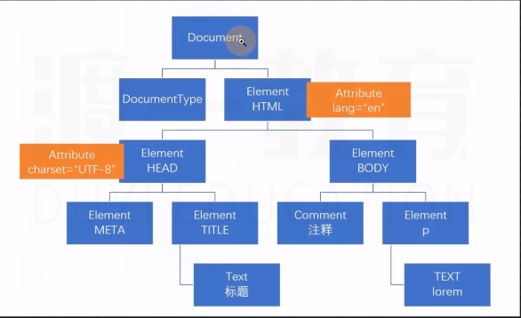

# 获取DOM节点

获取DOM节点

> 全局对象 window 中有属性document，代表的是整个文档节点

## 旧的获取元素节点的方式

DOM 0 

- ``document.body`` 获取body元素节点

- ``document.head`` 获取head元素节点

- ``document.links`` 获取页面上所有的超链接元素节点，类数组

- ``document.anchors`` 获取页面上的，锚链接元素节点，具有name属性

- ``document.form`` 获取页面中所有的form元素节点

## 新的获取元素节点的方式

### 通过方法获取

- ``document.getElementById("")``  通过id获取对应id的元素

- ``document.getElementsByTagName("")``  通过元素名称获取元素，得到类数组

- ``document.getElementsByClassName("")``通过元素的类样式获取元素，IE9以下无效

- ``document.getElementsByName("")``通过元素的name元素获取元素

- ``document.querySelector("")``通过CSS选择器获取元素，只会获取匹配的第一个，IE8以下无效

- ``document.querySelectorAll("")``通过CSS选择器获取元素，获取所有匹配的结果，IE8以下无效

- ``document.documentElement``获取根元素

细节：

1. 在所有得到类数组的方法中，除了querySelectorAll，其他的都是实时更新的

2. getElementById得到元素执行效率最高

3. 书写了Id的元素会自动成为window的对象，它是一个实时的单对象

4. ``getElementsByTagName`` ``getElementsByClassName``  ``querySelector``  ``querySelectorAll``可以作为其他元素节点对象方法使用

### 根据节点关系获取节点

- **``oDiv.parentNode``**:获取父节点，父元素

- ``oDiv.previousSibling``:获取上一个兄弟节点

- ``oDiv.nextSibling``:获取下一个兄弟节点

- ``oDiv.childNodes``:获取所有的子节点

- ``oDiv.firstChild``:获取第一个子节点

**获取元素节点**

- ``oDiv.parentElement``获取父元素

- ``oDiv.previousElementSibling``获取上一个兄弟元素

- ``oDiv.nextElementSibling``获取下一个兄弟元素

- ``oDiv.children``获取子元素

- ``oDiv.firstElementChild``获取第一个子元素

- ``oDiv.lastElementChild``获取最后一个子元素

## 获取节点信息

- ``oDiv.nodeName``获取节点名称

- ``oDiv.nodeValue``获取节点的值

- ``oDiv.nodeType``获取节点类型，返回一个数

准备两个数组，分别存放list1和list2中所有超链接内容

```html
    <ul id="list1">
        <li><a href="">Lorem ipsum dolor sit amet.</a></li>
        <li><a href="">Autem non qui sunt! Mollitia.</a></li>
        <li><a href="">Deleniti blanditiis illo error sapiente?</a></li>
        <li><a href="">Officia porro harum corrupti voluptate?</a></li>
        <li><a href="">Dolores facilis commodi esse dicta!</a></li>
        <li><a href="">Voluptatem vel alias quo nisi.</a></li>
    </ul>
    <ul id="list2">
        <li><a href="">Lorem ipsum dolor sit amet.</a></li>
        <li><a href="">Odit architecto earum sapiente dolorum.</a></li>
        <li><a href="">Quod laborum id eius repellat!</a></li>
        <li><a href="">Sunt magni error obcaecati ipsam.</a></li>
        <li><a href="">Reprehenderit mollitia provident quia ipsum.</a></li>
        <li><a href="">Facere facilis incidunt excepturi sed!</a></li>
    </ul>
```

```js
var list1Links = [],
    list2Links = [];
    //得到某个元素下面的所有a元素的内容数组
function getlinkContents(dom){
    var arr = dom.getElementsByTagName('a');
    var newArr= [];
    for(var i= 0;i<arr.length;i++){
        var a = arr[i];
        newArr.push(a.firstChild.nodeValue)
    }
    return newArr;
}
list1Links = getlinkContents(document.getElementById('list1'));
console.log(list1Links)
list2Links = getlinkContents(document.getElementById('list2'));
console.log(list2Links)
```

写一个函数，找到它的第一个div父级元素

```html
    <div class="oDiv">
        <ul id="list1">
            <li><a id="a" href="">Lorem ipsum dolor sit amet.</a></li>
            <li><a href="">Autem non qui sunt! Mollitia.</a></li>
            <li><a href="">Deleniti blanditiis illo error sapiente?</a></li>
            <li><a href="">Officia porro harum corrupti voluptate?</a></li>
            <li><a href="">Dolores facilis commodi esse dicta!</a></li>
            <li><a href="">Voluptatem vel alias quo nisi.</a></li>
        </ul>
        <ul id="list2">
            <li><a href="">Lorem ipsum dolor sit amet.</a></li>
            <li><a href="">Odit architecto earum sapiente dolorum.</a></li>
            <li><a href="">Quod laborum id eius repellat!</a></li>
            <li><a href="">Sunt magni error obcaecati ipsam.</a></li>
            <li><a href="">Reprehenderit mollitia provident quia ipsum.</a></li>
            <li><a href="">Facere facilis incidunt excepturi sed!</a></li>
        </ul>

    </div>
```

```js
function getDivContainer(dom){
    var parent = dom.parentElement
    while(parent !==null && parent.nodeName !== "DIV"){
        parent = parent.parentElement;
    }
    return parent;
}

var a = document.getElementById('a');
console.log(getDivContainer(a))
```

# DOM元操作

## 初识元素事件

元素事件：某个元素发生一件事（被点击click）

事件处理程序：是一个函数，发生了一件事，应该做什么事情

注册事件：将事件处理程序与某个事件关联

```html
    <button id="btn">点我</button>
```

```js
    var btn = document.getElementById('btn');
    var count = 0;
    //注册事件
    btn.onclick = function(){
        console.log(count);
        count++;
    }
```

**this关键字在事件处理程序中指代当前发生的事件元素**

## 获取和设置元素内容

- 通用方式：``getAttribute``、``setAttribute``不适用可识别属性（自带属性）

### 可识别属性

正常的HTML属性

- ``DOM对象.属性``

```html
    <input type="text" value="123" name="" id="">
    <button id="btnGetText">点我</button>
    <button id="btnSetText">点我</button>
```
```js
    document.getElementById('btnGetText').onclick = function(){
        //获取文本框的值
        console.log(document.querySelector('input[type="text"]').value);
    }
    document.getElementById('btnSetText').onclick = function(){
        //设置文本框的值
        document.querySelector('input[type="text"]').value = 'hello world';
    }
```

细节：

1. 正常的属性，即使没写，也有默认值

2. 布尔属性在DOM对象中，得到的是boolean

3. 某些表单元素可以获取到某些不存在的属性

4. 某些属性与标志符冲突，此时，需要更换属性名 ``for``>>>```htmlfor``  ``class``>>>``className``

### 自定义属性

HTML5建议自定义属性使用``data-``作为前缀

如果遵从HTML5自定义属性规范，可以使用``DOM对象.dataset.属性名``控制属性

## 获取和设置元素内容

- ``innerHTML``获取和设置元素内部的HTML文本

- ``innerText``获取和设置元素内部的纯文本

- ``textContent``获取和设置元素内部的纯文本,textContent得到的是内部所有的文本（源代码的文本）

## 元素结构重构

- ``DOM1.appendChild(DOM2)``在DOM1元素（父元素）末尾加入DOM2元素（子元素），只能添加一个

- ``DOM1.append(DOM2)`` 同``appendChild``,能添加多个，不推荐使用

- ``DOM1.insertBefore(DOM2,DOM3)``在DOM1元素（父元素）中，在DOM3元素（子元素）前插入DOM2元素（子元素）

- ``DOM1.replaceChild(DOM2,DOM3)``在DOM1元素（父元素）中，将DOM3元素（子元素）替换为DOM2元素（子元素）

细节：**更改元素结构效率较低，尽量少用**

## 创建和删除原始

### 创建元素

- ``document.createElement('元素')``创建一个元素对象

- ``document.createTextNode('')``创建一个文本节点

- ``document.DocumentFragment()``创建文档片段

```html
    <ul id="ul1">
        <li>Lorem, ipsum.</li>
        <li>Aliquid, aspernatur.</li>
        <li>Dignissimos, labore.</li>
        <li>Facere, cupiditate.</li>
    </ul>
```

```js
        var ul = document.getElementById('ul1');
        var frag = document.createDocumentFragment();
        for (var i = 0; i < 10; i++) {
            var li = document.createElement('li');
            li.innerHTML = 'li' + (i + 1);
            frag.appendChild(li);
        }
        ul.appendChild(frag);
```

### 克隆元素

- ``DOM.cloneNode(是否深度克隆)``复制一个新的DOM对象并返回，参数为true则为深度克隆

### 实时集合

在所有得到类数组的方法中，除了querySelectorAll，其他的都是实时更新的，childNodes也是实时集合

### 删除元素

- ``DOM1.removeChild(DOM2)`` 父元素删除子元素，返回一个元素

- ``DOM.remove``元素自身删除

**删除自定义属性**

- ``removeAttribute('属性名')``

- ``delete DOM.dataset.属性名``
  

1. 实现删除清空列表

```html
    <div class="container">
        <P>
            <button id="btnClear">清空</button>
        </P>
        <ul class="list">
            <li>项目1<button>删除</button></li>
            <li>项目2<button>删除</button></li>
            <li>项目3<button>删除</button></li>
            <li>项目4<button>删除</button></li>
            <li>项目5<button>删除</button></li>
            <li>项目6<button>删除</button></li>
            <li>项目7<button>删除</button></li>
            <li>项目8<button>删除</button></li>
            <li>项目9<button>删除</button></li>
            <li>项目10<button>删除</button></li>
        </ul>
    </div>
```
```js
        var btnClear = document.getElementById('btnClear');
        var ul = document.querySelector('.list');
        var btnList = ul.getElementsByTagName('button');
        btnClear.onclick = function(){
            //清空按钮，清除ul里所有的文本内容
            ul.innerHTML = '';
        }
        //得到ul下的所有按钮
        for(var i=0;i<btnList.length;i++){
            var n = btnList[i];
            regEvent(n);
        }
        //元素删除函数
        function regEvent(n){
            n.onclick = function(){
                //得到所点击的按钮的父级元素，并将其删除
                n.parentElement.remove();
            }
            
        }
```

2. 图片切换器

```html
    <div class="banner">
        
        <p>
            <button id="btnPrve">上一张</button>
            <button id="btnNext">下一张</button>
        </p>
    </div>
```

```js
        var i =1;
        var img = document.getElementsByTagName('img');
        var btnPrve = document.getElementById('btnPrve');
        var btnNext = document.getElementById('btnNext');
        //上一张按钮的事件绑定
        btnPrve.onabort=function(){
            i--;
            //判断是否当前是第一张图片，若是，就跳到最后一张
            if(i===0){
                i=5;
            }
            img.src= i+'.img';
        }
        //下一张按钮的事件绑定
        btnNext.onabort=function(){
            i--;
            //判断是否是最后一张图片，若是，跳到第一张
            if(i===6){
                i=1;
            }
            //拼接图片的src
            img.src= i+'.img';
        }
```

3. 库存变更器

```html
    <div>
        库存
        <button data-set="-1000">-1000</button>
        <button data-set="-100">-100</button>
        <button data-set="-10">-10</button>
        <button data-set="-1">-1</button>
        <span id="spanNumber">100</span>
        <button data-set="1">+1</button>
        <button data-set="10">+10</button>
        <button data-set="100">+100</button>
        <button data-set="1000">+1000</button>
    </div>
```

```js
    var btns = document.querySelectorAll('button');;
    var span = document.getElementById('spanNumber');
    //循环遍历每个按钮，给每个按钮添加事件
    for (var i = 0; i < btns.length; i++) {
        //得到当前遍历的按钮
        var b = btns[i];
        b.onclick = function () {
            //得到内容框的文本内容，并转化为整数
            var num = parseInt(span.innerHTML);
            //得到当前遍历按钮的文本内容，并转化为整数
            var set = parseInt(this.dataset.set);
            //内容框的内容与按钮的内容相加减
            var result = num + set;
            //判断得到的值是否小于0，库存最小值为0，不能为负数
            if (result <= 0) {
                result = 0;
            }
            //将内容框的文本重新赋值
            span.innerHTML =result ;
        }
    }
```

4. 添加文本

```html
    <style>
        p {
            display: none;
        }

        .error {
            color: red;
            display: block;
        }
    </style>

    <div class="container">
        <p>不能添加空文本</p>
        <div>
            <input type="text" name="" id="">
            <button id="btnAdd">添加</button>
        </div>
        <ul class="list">
            <li>项目1</li>
            <li>项目2</li>
        </ul>
    </div>
```

```js
    var btnAdd = document.getElementById('btnAdd');
    var ul = document.querySelector('.list');
    var inp = document.querySelector('input');
    var p = document.querySelector(('p'))
    btnAdd.onclick = function () {
        //trim函数，去掉字符串两端的空格  去掉空格后判断输入框的内容是否是空
        if (!inp.value.trim()) {
            //如果是空，提示
            p.className = 'error';
        } else {
            //不是空
            p.className = '';
            //创建一个新的li
            var li = document.createElement('li');
            //将新的li的文本内容设置成输入框的内容
            li.innerHTML = inp.value;
            //将新的li插入到ul内
            ul.appendChild(li);
            //文本框的内容重置
            inp.value = '';
        }
    }
```

5. 实现穿梭框

```html
    <style>
        .box div {
            float: left;
            margin: 0 30px;
        }

        .box .mid {
            margin: 60px 0;
        }
    </style>
    <div class="box">
        <div class="left">
            <h2>数组一</h2>
            <select name="" id="sel1" class="left" multiple style="width: 100px;height: 170px;font-size: 22px;">
                <option value="1">1</option>
                <option value="2">2</option>
                <option value="3">3</option>
                <option value="4">4</option>
                <option value="5">5</option>
            </select>
        </div>
        <div class="mid">
            <p>
                <button id="toRight" title="右移动选中">&gt;&gt;</button>
            </p>
            <p>
                <button id="toRightAll" title="右移动全部">&gt;&gt;|</button>
            </p>
            <p>
                <button id="toLeft" title="左移动选中">&lt;&lt;</button>
            </p>
            <p>
                <button id="toLeftAll" title="左移动全部">|&lt;&lt;</button>
            </p>
        </div>
        <div class="right">
            <h2>数组二</h2>
            <select name="" id="sel2" class="left" multiple style="width: 100px;height: 170px;font-size: 22px;">
                <option value="6">6</option>
            </select>

        </div>
    </div>
```

```js
    var toRight = document.querySelector("#toRight"),
        toRightAll = document.querySelector("#toRightAll"),
        toLeft = document.querySelector("#toLeft"),
        toLeftAll = document.querySelector("#toLeftAll"),
        selLeft = document.querySelector('#sel1'),
        selRight = document.querySelector('#sel2')

    //得到某个select中被选中得option元素
    function getSelectedOptions(sel) {
        return Array.from(sel.children).filter(function (item) {
            return item.selected;
        });
        // var opts = [];
        // for (var i = 0; i < sel.children.length; i++) {
        //     if (sel.children[i].selected) {
        //         opts.push(sel.children[i]);
        //     }
        // }
        // return opts;
    }


    //将opts数组中的数组项添加到select元素中
    //opts:要移动的数组
    //sel:目标select元素
    function appendToSelect(opts, sel) {
        opts =Array.from(opts);
        var frag = document.createDocumentFragment();
        for (var i = 0; i < opts.length; i++) {
            opts[i].selected = false;
            frag.appendChild(opts[i]);
        }
        sel.appendChild(frag);
    }


    toRight.onclick = function () {
        //选中左边选中的
        var opts = getSelectedOptions(selLeft);
        //循环将该数组添加到右边的select中
        appendToSelect(opts, selRight);
    }


    toRightAll.onclick = function () {
        //将左边所有的option移动到右边的select中
        appendToSelect(selLeft.children, selRight);
    }


    toLeft.onclick = function () {
        //选中右边选中的
        var opts = getSelectedOptions(selRight);
        //循环将该数组添加到左边的select中
        appendToSelect(opts, selLeft);
    }


    toLeftAll.onclick = function () {
        //将右边所有的option移动到左边的select中
        appendToSelect(selRight.children, selLeft);
    }
```

# DOM元素样式

## 控制DOM元素的类样式

- ``className``：获取或设置元素的类名

```html
    <style>
        .item {
            width: 100px;
            height: 100px;
        }

        .red {
            background-color: red;
        }

        .green {
            background-color: green;
        }
    </style>
    <div class="item red"></div>
```

```js
    //获取元素
    var oDiv = document.querySelector('div')
    oDiv.onclick = function () {
        //元素可能有多个类名，判断类名中是否有该类名，search函数寻找该正则表达式的索引开始位置，若未找到，则返回-1，\b正则单词边界
        if (this.className.search(/\bred\b/) !== -1) {
            //找到该类名，将其替换成green
            this.className = this.className.replace(/\bred\b/, 'green');
        } else {
            //未找到，则说明该元素类名有拎一个类名green，将其替换为red类名
            this.className = this.className.replace(/\bgreen\b/, 'red');

        }
    }
```

- ``classList``:DOM4的新属性，是一个用于控制元素类名的对象
     
     1) ``add``:用于添加一个类名
     2) ``remove``:用于移除一个类名
     3) ``toggle``:用于添加/移除一个类名（不填第二个参数：没有就添加，有就删除   第二个参数：true添加，false移除）
     4) ``contain``:用于判断一个类名是否存在


## 获取样式

- ``dom.style``：得到**行内样式**对象

- ``window.getComputedStyle(dom元素)``：得到某个元素最终计算的样式

    可以有第二个参数，用于得到某个元素的某个伪元素样式``getComputedStyle(dom,'before')``
  
**CSS的短横线命名，需要转化为小驼峰式命名``dom.style.backgroundColor``**

## 设置样式

- ``dom.style.样式名= 值``设置的是行类样式

1. 实现点击添加样式

```html
    <style>
        .selected {
            color: burlywood;
        }

        div {
            width: auto;
            height: 15px;
            background-color: dimgray;
        }

        .container div {
            height: 20px;
            margin-left: 20px;
            float: left;
            cursor: pointer;
        }
    </style>
    <div class="container">
        <div>Lorem.</div>
        <div>Recusandae.</div>
        <div>Est.</div>
        <div>Nemo!</div>
        <div>Ut!</div>
    </div>
```

```js
    var container = document.querySelector('.container');
    var boxs = container.querySelectorAll('div');
    //利用from函数将类数组转化为真数组，并用数组的forEach函数循环遍历
    Array.from(boxs).forEach(function (item) {
        //循环遍历添加点击事件
        item.onclick = (function () {
            //利用from函数将类数组转化为真数组，并用数组的forEach函数循环遍历
            Array.from(boxs).forEach(function (item) {
                //先将这些元素原有的类名去掉
                item.classList.remove('selected');
            })
            再给点击的元素添加类名，拥有CSS样式
            this.classList.add('selected')
        })
    })
```

2. 随机背景颜色

```html
    <style>
        .container{
            width: 100px;
            height: 100px;
            border: 1px solid black;
        }
    </style>
    <div>
        <p>点击div，设置div的随机背景颜色</p>
        <div class="container"></div>
    
    </div>
```

```js
        var div = document.querySelector('.container');
        div.onclick = function(){
            //给div添加点击事件，改变其背景颜色
            this.style.background = 'rgb('+randomColor()+','+randomColor()+','+randomColor()+')'
        }
        function randomColor(){
            //设置随机数，在0~255之间随机取值，并返回
            var i =  parseInt(Math.random()*255);
            return i;
        }
```

3.  放大或缩小

```html
    <style>
        .container {
            width: 200px;
            height: 200px;
            border: 1px solid black;
            font-size: 100px;
            line-height: 200px;
            text-align: center;
            font-family: 宋体;
        }
    </style>
    <div>
        <p>点击div，设置div字体大小</p>
        <button class="beBigger">放大</button>
        <button class="beSmall">缩小</button>
        <div class="container">淦</div>
    </div>
```
```js
    var div = document.querySelector('.container');
    var beBigger = document.querySelector('.beBigger');
    var beSmall = document.querySelector('.beSmall');
    beBigger.onclick = function () {
        //得到当前字体大小,需加parseInt，将字符串返回一个整数
        var size = parseInt(getComputedStyle(div).fontSize);
        //三目运算符限制最大值
        var result = size + 10 > 200 ? 200 : (size + 10);
        //属性后面需拼接单位
        div.style.fontSize = result + 'px';
    }
    beSmall.onclick = function () {
        //得到当前字体大小,需加parseInt，将字符串返回一个整数
        var size = parseInt(getComputedStyle(div).fontSize);
        //三目运算符限制最小值
        var result = size - 10 < 10 ? 10 : (size - 10);
        //属性后面需拼接单位f
        div.style.fontSize = result + 'px';
    }
```

# dom事件

## 术语

- 事件：发生一件事

- 事件类型：点击、鼠标移入、鼠标移出、鼠标按下、键盘按下.....

- 事件处理程序：一个函数，用于当某件事件发生时运行

- 事件注册：将一个事件处理程序关联到某个事件

## 事件流

当某个事件发生时，哪些元素会监听到该事件发生，这些元素发生该事件的顺序叫做事件流

**当一个元素发生某个事件时，那该元素的所有祖先都发生了该事件**

- 冒泡事件：先触发最里层的元素，在依次触发外层元素

- 事件捕获：先触发外层的元素，然后再依次触发里面的元素

目前，标准规定，默认情况下，事件是冒泡方式进行触发

事件源、事件目标：事件目标阶段的元素

# 事件注册（事件绑定）

## dom0

将事件名称前面加上on，作为dom的属性名，给该属性赋值为一个函数，即为事件注册

1. 文件形式添加

```html
    <button>点击</button>
```
```js
    var btn = document.querySelector('button');
    btn.onclick = function(){
        console.log(1);
    }
```

2. 行内样式添加

```html
    <button onclick="console.log(1);">点击</button>
```

移除：重新给事件属性赋值，通常赋值为null或undefined

## dom2

``dom对象.addEventListener``:注册事件

与dom0的区别

1. dom2可以为某个元素的同一个事件，添加多个处理程序

2. dom2允许开发者控制事件处理的阶段，默认情况为冒泡阶段，使用第三个参数，表示是否在捕获阶段触发（父级元素的事件先触发）
   
   - 如果元素是目标元素（事件源），第三个参数无效

```html
    <button>点击</button>
```
```js
    var btn = document.querySelector('button');
    //事件触发顺序与注册顺序一致，输出  1  2
    btn.addEventListener('click',function(){
        console.log(1);
    })
    btn.addEventListener('click',function(){
        console.log(2);
    })
```

```html
    <div>
        <button>点击</button>
    </div>
```
```js
    var btn = document.querySelector('button');
    var div = document.querySelector('div');
    btn.addEventListener('click',function(){
        console.log(1);
    })
    div.addEventListener('click',function(){
        console.log(2);
    },true)//捕获阶段先触发
```

事件的移除：``dom对象.removeEventListener(事件名,处理函数);``

**dom2中如果要移除事件，不能使用匿名函数**

```html
    <button class="click">点击</button>
    <button class="remove">移除</button>
```

```js
    var btn = document.querySelector('.click');
    var btnRemove = document.querySelector('.remove');


    function toClick() {
        console.log(1);
    }

    //给btn添加事件
    btn.addEventListener('click', toClick);

    //给btnRemove添加事件
    btnRemove.addEventListener('click', function () {
        btn.removeEventListener('click', toClick)
    })
```

**细节：**

1. dom2在IE8及以下不兼容，需要使用attachvent，detachEvent，无第三个参数

2. 添加和移除事件时，可以将第三个参数写为一个对象，进行相关配置

```html
        <button>点击</button>  
```

```js
    var btn = document.querySelector('button');
    btn.addEventListener('click',function(){
        console.log(1);
    },{
        capture:false,//是否捕获阶段运行,默认false
        once:true//是否只运行一次,默认false
    })
```


# 事件对象

事件对象封装了相关事件的相关信息

## 获取事件对象

- 通过事件处理函数的参数获取

```html
    <button class="click">点击</button>
```
```js
        var btn = document.querySelector('.click');
        btn.onclick = function(e){
            console.log(e.target);
        }
```

- 旧版本的IE浏览器通过window.event获取

## 事件对象的通用成员

- **``target`` & ``srcElement``事件目标（事件源）**

```html
    <button class="click">点击</button>
```
```js
        var btn = document.querySelector('.click');
        btn.onclick = function(e){
            console.log(e.target);
        }
```
**事件委托：通过给祖先元素注册事件，在程序处理程序中判断事件源进行不同的处理**

通常，事件委托用于动态生成元素的区域

```html
    <div>
        <p><span>Lorem ipsum dolor sit amet.</span><button>删除</button></p>
        <p><span>Sequi, cumque. Quos, doloremque qui?</span><button>删除</button></p>
        <p><span>Inventore magnam quo veniam laboriosam.</span><button>删除</button></p>
        <p><span>Eligendi commodi ipsam perspiciatis aut!</span><button>删除</button></p>
        <p><span>Enim sunt fuga odio eius!</span><button>删除</button></p>
    </div>
```

```js
    var div = document.querySelector('div');
    div.onclick = function(e){
        if(e.target.tagName === "BUTTON"){
            e.target.parentElement.remove();
        }
    }
```

- ``currentTarget``表示当前目标（绑定事件的元素，等效于this）

```html
    <div>
        <button>点击</button>
    </div>
```

```js
    var div = document.querySelector('div');
    div.onclick = function(e){
        console.log(e.currentTarget,this,e.currentTarget ===this)
    }
```

- ``type``事件类型

```html
    <div>
        <button>点击</button>
    </div>
```

```js
    var div = document.querySelector('div');
    div.onclick = function(e){
        console.log(e.type);//click
    }
```

- **``preventDefault`` & ``returnValue``阻止浏览器默认行为**

dom0:处理程序中 ``return false``即可阻止默认事件

```html
    <a href="https://www.baidu.com">百度</a>
    <form action="https://www.taobao.com">
        <p>
            <input type="text" name="account" id="">
        </p>
        <p>
            <button>提交</button>
        </p>
    </form>
 ```
```js
    var a = document.querySelector('a');
    var btn = document.querySelector('button');

    a.addEventListener('click',function(e){
        e.preventDefault();//阻止浏览器默认行为
        console.log(1);
    })
    btn.onclick = function(e){
        console.log(2);
        e.preventDefault();//阻止浏览器默认行为
    }
```

**针对a元素，可以设置为功能性链接，解决跳转问题**

```js
    <a href="JavaScript:;">百度</a>
```

- **``stopPropagation``阻止事件冒泡**

```html
    <div>
        <button>点击</button>
    </div>
```
```js
    var div = document.querySelector('div');
    var btn = document.querySelector('button');

    div.addEventListener('click', function (e) {
        console.log(1);
    });
    btn.onclick = function (e) {
        console.log(2);
        e.stopPropagation();//阻止事件冒泡
    }
```

- ``eventPhase``得到事件所处的阶段

1：表示事件捕获

2：表示事件目标

3：表示事件冒泡

1. 添加、删除动态列表

```html
    <p>
        <input type="text">
        <button id="add">添加</button>
    </p>
    <ul>
        <li>
            <span>列表1</span>
            <button>删除</button>
        </li>
    </ul>
```
```js
    //获取元素
    var btnAdd = document.querySelector('#add');
    var inP = document.querySelector('input');
    var ul = document.querySelector('ul');
    //添加按钮注册事件
    btnAdd.onclick = function () {
        //创建元素
        var i = document.createElement('li');
        var span = document.createElement('span');
        var btnDelete = document.createElement('button');
        //判断input元素中是否有文本
        if (inP.value.trim) {
            //获取input元素的文本
            var result = inP.value;
            //将文本赋值给span
            span.innerHTML = result;
            btnDelete.innerHTML = '删除';
            //将span、button元素插入li元素
            i.appendChild(span);
            i.appendChild(btnDelete);
            //将li元素插入到页面
            ul.appendChild(i);
            //重置input元素的文本
            inP.value = '';
        }
    }
    //给ul元素注册事件，利用事件委托进行事件触发
    ul.onclick = function (e) {
        //判断点击事件的事件源是否是button元素
        if (e.target.tagName === 'BUTTON') {
            //删除button元素的父级
            e.target.parentElement.remove();
        }
    }
```

2. 更换图片

```html
    <div class="buttons">
    </div>
    
```
```js
        //图片信息
        var imgs = [
            'https://ss0.bdstatic.com/70cFvHSh_Q1YnxGkpoWK1HF6hhy/it/u=3416177271,254995497&fm=26&gp=0.jpg',
            'https://ss1.bdstatic.com/70cFvXSh_Q1YnxGkpoWK1HF6hhy/it/u=2530486543,113586312&fm=26&gp=0.jpg',
            'https://ss0.bdstatic.com/70cFvHSh_Q1YnxGkpoWK1HF6hhy/it/u=3880341262,3308316348&fm=26&gp=0.jpg',
            'https://ss0.bdstatic.com/70cFuHSh_Q1YnxGkpoWK1HF6hhy/it/u=2496571732,442429806&fm=26&gp=0.jpg',
            'https://ss2.bdstatic.com/70cFvnSh_Q1YnxGkpoWK1HF6hhy/it/u=2620306848,1106594030&fm=26&gp=0.jpg'
        ];
        var btns = document.querySelector('.buttons');
        //循环遍历图片信息数组
        imgs.forEach(function (src, i) {
            var btn = document.createElement('button');
            btn.style.marginRight = '20px';
            //添加自定义属性，保存每张图片的src
            btn.dataset.src = src;
            btn.innerHTML = `第${i + 1}张图片`;
            btns.appendChild(btn);
        })
        var img = document.querySelector('img');
        img.style.width = '300px';
        img.style.height = '300px';
        img.style.border = '1px solid #ccc'
        img.style.marginTop = '30px';
        //给div注册事件，通过事件委托，给按钮添加事件
        btns.onclick = function (e) {
            if (e.target.tagName === 'BUTTON') {
                //将button的自定义src属性值赋给img元素的src
                img.src = e.target.dataset.src;
            }
        }
```

# 鼠标事件

## 事件类型

- ``click`` 用户单击鼠标按钮（一般是左键）或者按下在聚焦时按下回车键时触发
  
- ``dblclick`` 用户双击鼠标时触发（频率取决于系统配置）

- ``mousedown`` 用户按下鼠标任意按键时触发

- ``mouseup`` 用户抬起鼠标任意按键时触发

- ``mousemove`` 鼠标在元素上移动时触发

- ``mouseover`` 鼠标进入元素时触发

- ``mouseout`` 鼠标离开元素时触发

- ``mouseenter`` 鼠标进入元素时触发，该事件不会冒泡

- ``mouseleave`` 鼠标离开元素时触发，该事件不会冒泡

**区别：**

- over和out，不考虑子元素，从父级移动到子元素，对于父元素而言，任然算是离开

- enter和leave，考虑子元素，子元素任然是父元素的一部分

- mouseenter和mouseleave不会冒泡

## 事件对象

所有的鼠标事件，事件处理程序中的事件对象，都为鼠标事件对象MouseEvent

- **altKey**：事件触发时，是否按下了键盘的Alt键

- **ctrlKty**：事件触发时，是否按下了键盘的Ctrl键

-  **shiftKty**：事件触发时，是否按下了键盘Shift键

- **button**：触发事件时，按下的按键类型（鼠标按下事件）

- 0：左键

- 1：中键

- 2：右键

```html
    <button>点击</button>
```
```js
        var btn = document.querySelector('button');
        btn.onmousedown = function(e){
            console.log(e.button);
        }
```

位置：

- **page**：pageX、pageY，当前鼠标距离页面的横纵坐标

```js
        var div = document.querySelector('div');
        div.style.width = '100%';
        div.style.height = '300px';
        div.style.background = 'red'
        div.onclick = function(e){
            console.log(e.pageX,e.pageY)
        }
```

- **client**：clientX、clientY，鼠标相对于视口的横纵坐标

- **offset**：offsetX、offsetY，鼠标相对于事件源的坐标（起始坐标为内边距，border以内）

```js
        var div = document.querySelector('div');
        div.style.width = '100%';
        div.style.height = '300px';
        div.style.background = 'red'
        div.onclick = function(e){
            console.log(e.offsetX,e.offsetY)
        }
```

- **screen**：screenX、screenY，鼠标相对于屏幕的横纵坐标

- **x、y**，等同于clientX、clientY，鼠标相对于视口的横纵坐标

- **movement**：movementX、movementY，只在鼠标异动事件中生效，相对于上一次鼠标位置偏移的距离


拖拽效果


```html
    <style>
        div{
            width: 70px;
            height: 70px;
            background-color: red;
            border-radius: 50%;
            cursor: pointer;
            position: absolute;
            left: 100px;
            top: 100px;
        }
    </style>
    <div></div>
    <script src="./myFunction.js"></script>
    <script src="./text.js"></script>
```

```js
        var div = document.querySelector('div');
        div.onclick =function(){
        }
        var style = getComputedStyle(div);
        var divLeft = parseFloat(style.left);
        var divTop = parseFloat(style.top);
        div.onmousedown = function (e) {
            console.log(1)
            if (e.button !== 0) {
                return;
            }

            window.onmousemove = function (e) {
                divLeft += e.movementX;
                divTop += e.movementY;
                div.style.left = divLeft + 'px';
                div.style.top = divTop + 'px';
            }
            window.onmouseup = function (e) {
                if (e.button === 0) {
                    window.onmousemove = null;
                }
            }
        }
```

# 键盘事件 

## 事件类型

- ``keydown``：按下键盘上任意键触发，如果按住不放，则会重复触发此事件

- ``keypress``：按下键盘的一个**字符键**时触发

- ``keyup``：抬起键盘上任意键触发

``keydown``、``keypress``如果组织了事件默认行为，文本不会显示

```js
        var inp = document.querySelector('input');
        inp.onkeydown = function (e) {
            console.log('按下');
            return false;
        }
        inp.onkeypress = function (e) {
            console.log('按住');
        }
        inp.onkeyup = function (e) {
            console.log('抬起');
        }
```

## 事件对象

``KeyboarEvent``

- ``code``：得到按键字符串，适配键盘布局

```js
        var inp = document.querySelector('input');
        inp.onkeydown = function (e) {
            console.log(e.code);//按下左Left，输出ShiftLeft
        }
```

- ``key``：得到按键字符串，不适配键盘布局

```js
        var inp = document.querySelector('input');
        inp.onkeydown = function (e) {
            console.log(e.key);//按下左Shift，输出Shift，不显示键盘位置
        }
```

- ``keyCode``、``which``：得到按键编码

# 其他时间

## 焦点事件

- ``focus``：元素聚焦时触发（能与用户发生交互的元素）

```js
        var inp = document.querySelector('input');
        inp.onfocus = function (e) {
            console.log('聚焦',e.bubbles);//bubbles返回该事件是否能冒泡
        }
```

- ``blur``：元素失去焦点时触发

```js
        var inp = document.querySelector('input');
        inp.onblur = function (e) {
            console.log('失去聚焦',e.bubbles);//bubbles返回该事件是否能冒泡
        }
```

```js
        var inp = document.querySelector('input');
        inp.onfocus = function (e) {
            if (this.value === this.defaultValue) {
                this.value = '';
                this.className = '';
            }
        }
        inp.onblur = function (e) {
            if (!this.value) {
                this.value = '请输入内容';
                this.className = 'noinput';
            }
        }
```

- ``submit``:提交表单事件，仅在form元素有用

```html
    <form action="https://www.taobao.com">
        <p>
            <input type="text" name="" id="" placeholder="请输入内容">
        </p>
        <button>按钮1</button>
        <button>按钮2</button>
    </form>
```

```js
        var form = document.querySelector('form');
        var inp = document.querySelector('input');
        form.onsubmit = function (e) {
            if (!inp.value.trim()) {
                console.log('请输入内容')
                return false;
            }
            console.log('正在提交...')
        }
```

- ``change``:文本改变事件

```html
    <select name="" id="">
        <option value="1">Lorem.</option>
        <option value="2">Sequi?</option>
        <option value="3">Saepe.</option>
        <option value="4">Repellat.</option>
        <option value="5">Nisi?</option>
    </select>
```

```js
        var sel = document.querySelector('select');
        sel.onchange =function(){
            console.log(sel.value,sel.options[sel.selectedIndex].innerHTML);
        }
```

- ``input``：文本改变事件（即时触发）

```js
        var inp = document.querySelector('input');
        inp.oninput =function(){
            console.log(inp.value)
        }
```

## 页面状态事件

- ``load``、``DOMContentLoaded``、``readystate``

 - ``load`` 页面中所有资源加载完毕的事件

```js
        window.onload = function(){
            console.log('加载完毕');
        }
```

- D``OMContentLoaded`` DOM树构建完成后触发

```js
        document.addEventListener('DOMContentLoaded',function(){
            console.log('DOM加载完毕');
        })
```

- ``readystate``:页面加载状态，输出**loading正在加载DOM树**、**interactive  DOM树加载完成**、**complete 网页加载完成**

 1. interactive：触发DOMContentLoaded事件

 2. complete：触发window.onload事件

```js
        document.addEventListener('DOMContentLoaded',function(){
            console.log(document.readyState);//interactive
        })
```

- ``readystatechange``:页面状态发生改变时触发，页面状态readystate

```js
document.onreadystatechange = function () {
    console.log(document.readyState)
}
```

 **JS代码应该尽量写到页面底部**

 - css应该写到页面顶部：避免出现闪烁（如果放到页面底部，会导致元素先没有样式，使用默认样式，然后读到css后，重新改变样式）

 - JS应该写到页面底部：避免阻塞后续的渲染，也避免运行JS时，得不到页面的元素

## 其他

- ``unload``、``beforeunload``

 - ``beforeunload``:window的事件，关闭窗口时运行，可以允许阻止关闭窗口（谷歌不支持）

 - ``unload``:window的事件，关闭窗口时运行（谷歌不支持）

- ``scroll``：窗口发生滚动的事件

**window获取scrollTop和scrollLeft**
```js
        window.onscroll = function(){
            console.log(document.documentElement.scrollTop,document.body.scrollTop);//两种获取方式
        }
```
  
**其他元素获取scrollTop和scrollLeft**
```js
        window.onscroll = function(){
            console.log(this.scrollTop);
        }
```

- ``resize``：窗口（视口）尺寸发生改变的事件（window事件）

```js
        window.onresize = function(){
            console.log(window.innerHeight,window.innerWidth);
        }
```

1. window元素中的宽高
   
 - ``window.innerHeight``,``window.innerWidth``：网页滚动尺寸（包括滚动条宽度）

 - ``document.documentElement.clienWidth``、``document.documentElement.clienHeight``：视口尺寸（不包括滚动条宽高）

 - ``window.outerWidth``、``window.outerHeight``：浏览器宽高

 - ``window.screen.height``、``window.screen.width``：屏幕宽高

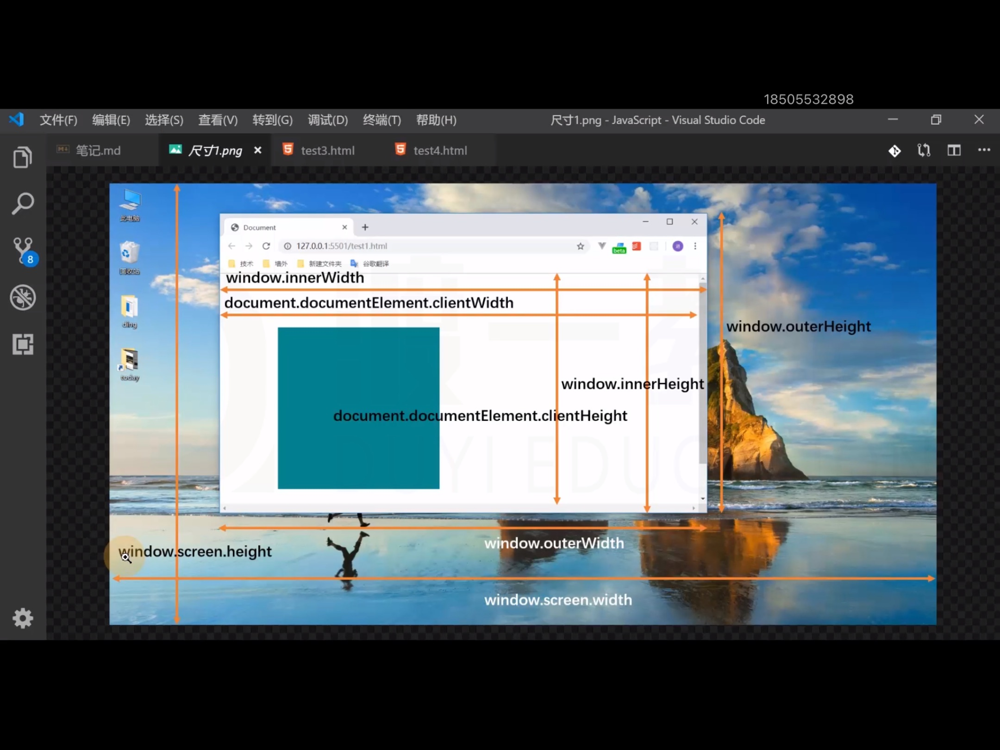

2. 元素中的宽高

 - ``div.clienWidth``、``div.clienHeight``：元素滚动的宽高（不包括滚动条）

 - ``div.offsetWidth``、``div.offsetHeight``：元素的真实宽高

 - ``div.scrollWidth``、``div.scrollHeight``：元素中实际内容的高度

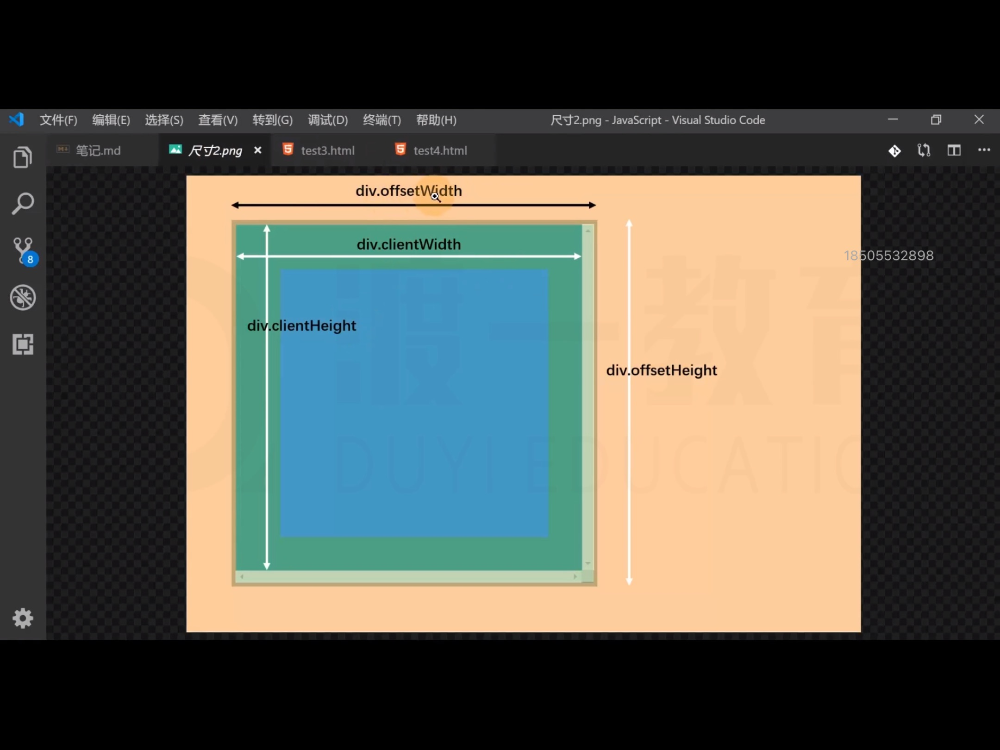

- ``contextmenu``：右键菜单时间，可取消默认事件

- ``paste``：粘贴事件，可取消默认事件

- ``copy``：复制事件，可取消默认事件

- ``cut``：剪切事件

### 事件补充

- ``offsetParent``：获取某个元素第一个定位的祖先元素，如果没有，则得到body

body的``offsetParent``为null

```html
    <style>
        .box1{
            position: relative;
        }
    </style>
    <div class="box1">
        <div class="box2">
            <div class="box3"></div>
        </div>
    </div>
```

```js
    var box3 = document.querySelector('.box3');
    console.log(box3.offsetParent);
```

- ``offsetLeft``、``offsetTop``:相对于该元素的offsetParent的页面坐标

如果offsetParent是body，则将其当做整个网页

- ``getBoundingClientRect``：得到一个对象，该对象记录了该元素**相对于视口**的距离

### 事件模拟
   
- ``click``、``sumbit``

```html
    <style>
        div{
            width: 100px;
            height: 100px;
            background-color: red;
        }
    </style>
    <form action="https://www.taobao.com">
        <div></div>
    </form>
```
```js
        var div =document.querySelector('div');
        var  form = document.querySelector('form');
        div.onclick =function(){
            form.submit();
        }
```

实现吸附效果

```html
    <style>
        .left {
            width: 78%;
            float: left;
            border: 1px solid #000;
        }

        .right {
            width: 18%;
            float: right;
        }

        .first {
            border: 1px solid #000;
        }

        .last {
            width: 100%;
            height: 200px;
            background-color: red;
        }
    </style>
    <div class="left">Lorem 10000</div>
    <div class="right">
        <div class="first">Lorem 1000</div>
        <div class="last"></div>
    </div>
```
```js
        var div = document.querySelector('.last')
        var scrollTop = 0;
        //绑定滚轮滑动事件
        window.onscroll = function () {
            //getBoundingClientRect：得到一个对象，该对象记录了该元素相对于视口的距离
            //监听滑块在视口的位置
            var rect = div.getBoundingClientRect();
            console.log(window.scrollY)
            if (rect.top < 0) {
                //top小于0时，设置成固定定位
                div.style.position = 'fixed';
                div.style.top = 0;
                //读取rect里滑块的宽高和left值并赋值
                div.style.left = rect.left + 'px';
                div.style.width = rect.width + 'px';
                div.style.height = rect.height + 'px';
                div.style.boxSizing = 'borderBox';
                //记录滚动条的位置
                //window.scrollY，滚动条滚动的长度
                scrollTop = window.scrollY + rect.top;
               
            }
            if (window.scrollY < scrollTop) {
                div.setAttribute('style', '');
            }
        }
```

- ``dispatchEvent``：触发事件

```html
    <button class="btn1">1</button>
    <button class="btn2">2</button>
    <button class="btn3">3</button>
```
```js
        var btn1 = document.querySelector('.btn1');
        var btn2 = document.querySelector('.btn2');
        var btn3 = document.querySelector('.btn3');
        btn1.onmouseenter = function(){
            this.style.background = 'red';
            this.style.color = '#fff';
        }
        btn1.onmouseleave = function(){
            this.style.background = '#fff';
            this.style.color = '#000';
        }
        btn2.onclick =function(){
            //构建函数创建事件函数，用div.dispatchEvent(event)去触发这个事件
            var event = new MouseEvent('mouseenter');
            btn1.dispatchEvent(event);
        }
        btn3.onclick =function(){
            //构建函数创建事件函数，用div.dispatchEvent(event)去触发这个事件
            var event = new MouseEvent('mouseleave');
            btn1.dispatchEvent(event);
        }
```

### 其它补充

- ``window.scrollX``、``window.scrollY``、``windoe.pageXOffset``、``windoe.pageYOffset``

相当于根元素的``scrollLeft``、``scrollTop``

- ``scrollTo``：设置滚动条位置，直接跳转到设置参数

```js
window.scrollTo(100,100);
```
 
- ``scrollBy``：设置滚动条位置，在原来的基础上增加或减少

```js
window.scrollBy(100,100);
```

- ``resizeTo``、``resizeBy``：改变窗口尺寸，效果同``scrollTo``、``scrollBy``

# 计时器

BOM：Browser Object Model

- ``setTimeout``创建计时器函数，计时器是异步的，当时机成熟之后执行

计时器返回一个数字，该数字表示计时器的编号

  - clearTimeout：清除计时器

```html
    <button class="btn1">点击</button>
    <button class="btn2">清除</button>
```

```js
        var btn1 = document.querySelector('.btn1');
        var btn2 = document.querySelector('.btn2');
        var timer;
        btn1.onclick = function(){
            timer = setTimeout(function(){
                console.log('计时完成');
            },3000)
        }
        btn2.onclick =function(){
            clearTimeout(timer);
        }
```

**setTimeout实现连续调用计时器**

```html
    <h1>0</h1>
    <button class="btn1">点击</button>
    <button class="btn2">清除</button>
```

```js
        var btn1 = document.querySelector('.btn1');
        var btn2 = document.querySelector('.btn2');
        var h1 = document.querySelector('h1')
        var timer,num=0;
        btn1.onclick = function(){
            interval(function(){
                num++;
                h1.innerHTML =num; 
            },1000)
        }
        //利用回调函数和递归不断调用计时器
        function interval(callback,duration){
            timer = setTimeout(function(){
                callback();
                interval(callback,duration);
            },duration)
        }
        btn2.onclick =function(){
            clearTimeout(timer);
        }
```

- ``setInterval``:指定间隔时间到达后运行某个函数

  - ``clearInterval``：清除setInterval计时器

```html
    <h1>0</h1>
    <button class="btn1">点击</button>
    <button class="btn2">清除</button>
```

```js
        var btn1 = document.querySelector('.btn1');
        var btn2 = document.querySelector('.btn2');
        var h1 = document.querySelector('h1')
        var timer,num=0;
        btn1.onclick = function(){
            timer =setInterval(function(){
                num++;
                h1.innerHTML =num; 
            },1000)
        }
        btn2.onclick =function(){
            clearTimeout(timer);
        }
```

**实现数字时钟**

```html
    <style>
        body {
            text-align: center;
        }
    </style>
    <h1>1</h1>
```

```js
    var h1 = document.querySelector('h1');
    function setTime() {
        var date = new Date();
        var year = date.getFullYear();
        var month = date.getMonth();
        var day = date.getDate();
        var hour = date.getHours();
        var minute = date.getMinutes();
        var second = date.getSeconds();
        h1.innerHTML = `${year}年${month}月${day}日 ${hour.toString().padStart(2, '0')}:${minute.toString().padStart(2, '0')}:${second.toString().padStart(2, '0')}`
        h1.style.color =`rgba(${getRandom(0,255)},${getRandom(0,255)},${getRandom(0,255)})`;
        console.log(h1.style.color)
        function getRandom(min,max){
            return Math.floor(Math.random() * (max + 1 - min) + min);
        }
    }
    setTime();
    setInterval(setTime, (1000));
```

# window对象

## 自身方法

- ``open``：打开一个新窗口

第二个参数可填可不填，``_self``：在当前页面打开，``name名``：在该name名的iframe元素下打开，``null``：无

第三个参数在第二个参数为null时起作用，``'width=300,height=300'``：设置弹出窗口的参数

 ```js
    document.querySelector('button').onclick = function(){
        window.open('https://www.baidu.com')
    }
```

```js  
    document.querySelector('button').onclick = function () {
        window.open('https://www.baidu.com', null, 'width=300,height=300')
    }
```

- ``alert``：弹出提示框

- ``confirm``：弹出询问是否框，返回true或false

- ``prompt``：弹出输入框

## 对象属性

- ``document.write``：在当前文档流中写入内容，若当前文档流不存在，则新开一个文档流

- ``location``：地址栏对象
  
  - ``location.reload()``:重新加载页面

    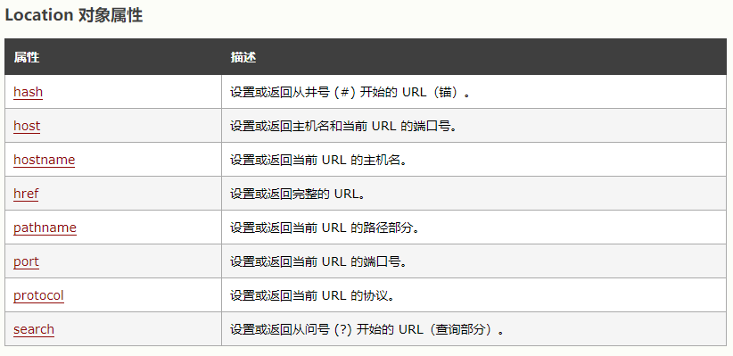

- ``navigator``：浏览器信息对象

    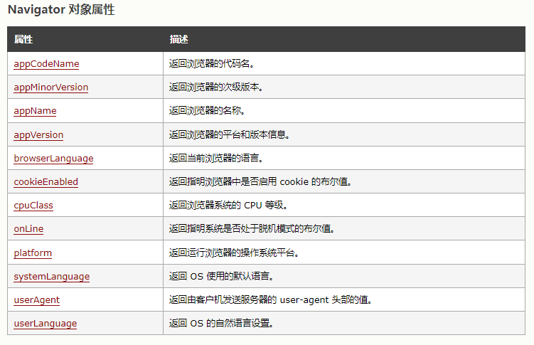

- ``history``：历史记录

    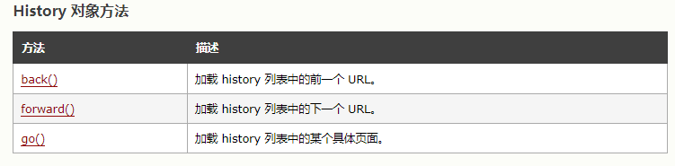

- ``console``:

    - log方法：打印对象的valueOf的返回值

    - dir方法：打印对象结构，返回对象

    - time和timeEnd方法：计时

```js        
        console.time('加载完成')
        var num=0;
        for(var i=0;i<10000;i++){
            num++;
        }
        console.timeEnd('加载完成')
```

# 原型和原型链

- 所有的对象都是通过``new 函数``来创建的

- 所有的函数都是对象

 - 函数中可以由属性

- 所有对象都是引用类型

## 原型 prototype

所有函数都有一个属性：prototype，称之为函数原型

默认情况下，prototype是一个普通的Object对象

默认情况下，prototype中有一个属性，constructor（祖先），它是一个对象，它指向构造函数本身

```js
    var obj ={};
    console.log(obj.constructor === Object);//true,obj的祖先是Object
    console.log(Object.prototype.constructor === Object);//true，Object的原型的祖先是Object
```

```js
    function test(){

    }
    var t = new test();
    console.log(test.prototype ===t.__proto__);//true
```

```js
    function test(){

    }
    var a = new test();
    var b = new test();
    a.abc =123;
    b.__proto__.bcd =456;
    console.log(a.abc,b.abc);//123,undefined
    console.log(a.__proto__.bcd,b.__proto__.bcd)//456,456
```

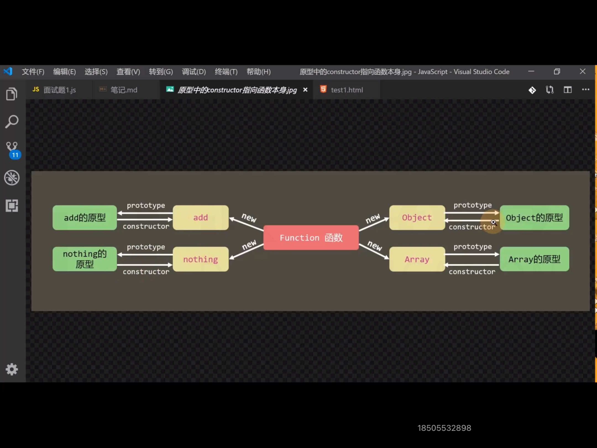
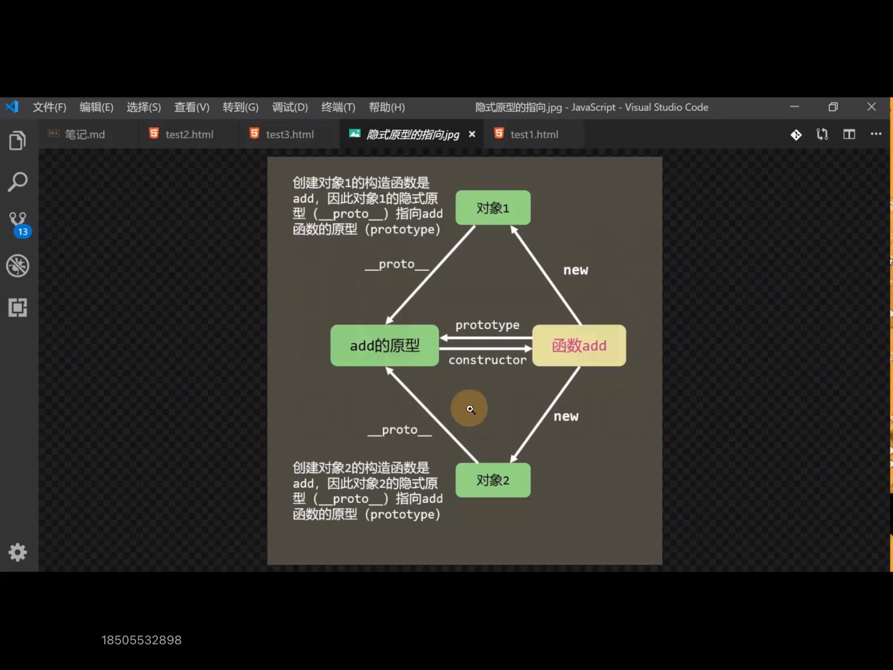

## 隐式原型 ``__proto__``

所有的对象都有一个属性，``__proto__``，称之为隐式原型

默认情况下，隐式原型指向创建该对象的原型

```js
        function test(){
        }
        var obj =new test();
        console.log(obj.__proto__ === test.prototype);//true
```


当访问一个对象的成员时：

1. 看该对象自身是否拥有该成员，如果有，直接使用；

2. 如果没有，在原型链中依次查找是否有该成员，如果有，直接使用

**猴子补丁：在函数原型中加入成员，以增强其对象的功能，但是会导致原型污染，需谨慎使用**

实现给字符串上加上大驼峰写法方法

```js
    String.prototype.camel= function(){
        return this.replace(/\b(\w)(\w*)\b/g,function($,$1,$2){
            return $1.toUpperCase()+$2
        }).replace(/\s/g,'')
    }
    var str ='asd dsad dgs';
    console.log(str.camel());//AsdDsadDgs
```

## 原型链

特殊点：

1. Function的__proto__指向自身的prototype

2. Object的prototype的__proto__指向null

```js
    function User(){}
    User.prototype.sayHello = function(){}
    var u1 = new User();
    var u2 = new User();
    console.log(u1.sayHello === u2.sayHello)//true
    console.log(User.prototype.constructor)//User Function
    console.log(User.prototype === Function.prototype)//false
    console.log(User.__proto__ ===Function.prototype)//true
    console.log(User.__proto__ ===Function.__proto__)//true
    console.log(u1.__proto__ === u2.__proto__)//true
    console.log(u1.__proto__ === User.__proto__)//false
    console.log(Function.__proto__ === Object.__proto__)//true
    console.log(Function.prototype.__proto__ ===Object.prototype.__proto__)//false
    console.log(Function.prototype.__proto__ === Object.prototype)//true
```

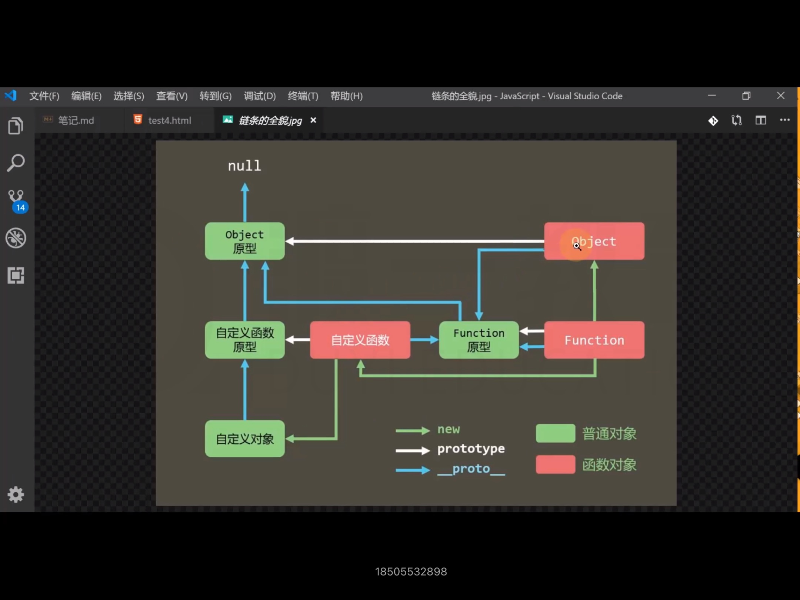

# 原型链的应用

## 基础方法

W3C不推荐直接使用系统成员__proto__

``Object.getPrototypeOf(对象)``：获取对象的隐式原型

```js
    var obj ={};
    console.log(obj.__proto__ === Object.getPrototypeOf(obj));//true
```

``object.prototype.isPrototypeOf(对象)``：判断当前对象是否在指定对象的原型链上

```js
    function A() {
        
    };
    var obj=new A();
    var o ={};
    console.log(Object.getPrototypeOf(o).isPrototypeOf(obj));//true  
    //Object.getPrototypeOf(o) o的隐式原型（Object的原型）
    //Object.getPrototypeOf(o).isPrototypeOf(obj)  判断自定义对象obj是否在o的隐式原型（Object的原型）的原型链上
```

``对象 instanceof 函数``：判断该函数的原型是否在该对象的原型链上

```js
    function A() {
        
    };
    var obj=new A();
    var o ={};
    console.log(obj instanceof o.__proto__.constructor);//true  
    //obj 自定义对象
    //o.__proto__.constructor  o的隐式原型的祖先（Object）
    //判断 o的隐式原型的祖先（Object）的原型是否在 自定义对象obj 的原型链上
```

``Object.create(对象)``：以该对象为隐式原型返回一个对象，可串null

```js
    var a = {
        a: 123,
        b: 234
    };
    console.log(Object.create(a));//以对象a为隐式原型创建一个新对象
```

``obj.hasOwnProperty(函数名)``：判断一个对象自身（不是原型链上）是否有某个属性

```js
        var a = {
            a: 123,
            b: 234
        };
        var obj =  Object.create(a);
        obj.c =345;
        obj.d =456;
        for(var prop in obj){
            if(obj.hasOwnProperty(prop)){
                console.log(prop);//c d
            }
        }
```

## 应用

**类数组转换为真数组**

``Array.from(类数组)``

``Array.prototype.slice.call(类数组)``

## 实现继承

默认情况下，所有构造函数的父类都是Object

```js
        //构造函数1
        function User(firstName, lastName, age) {
            this.firstName = firstName;
            this.lastName = lastName;
            this.age = age;
            this.fullName = this.firstName + '' + this.lastName;
        }
        //构造函数1原型上的sayHello方法
        User.prototype.sayHello = function () {
            console.log('Hello，我叫' + this.fullName + '，今年' + this.age + '岁了');
        }
        //构造函数2
        function VIPUser(firstName, lastName, age, money) {
            this.uber(this, firstName, lastName, age);
            this.money = money;
        }
        //判断是否存在myPlugin，防止重复
        if (!this.myPlugin) {
            this.myPlugin = {};
        }
        //给myPlugin上添加新方法，更改原型
        this.myPlugin.inherit = function (son, father) {
            son.prototype = Object.create(father.prototype);
            //由于son的constructor在更改指向后指向构造函数1，需要手动调整指向
            son.prototype.constructor = son;
            //获取构造函数1，方便调用
            son.prototype.uber = father
        }
        //调用更改原型的方法，将构造函数2的原型改为构造函数1创建的一个对象
        myPlugin.inherit(VIPUser, User);
        //给构造函数2原型上添加upgrade方法
        VIPUser.prototype.upgrade = function () {
            this.money -= 100;
            console.log(`恭喜你，使用了100软妹币，升级了，还剩${this.money}元`);
        }
        //用构造函数2创建一个新对象
        var vUser = new VIPUser('鲁', '迅', 6, 1000);
        console.log(vUser)
```

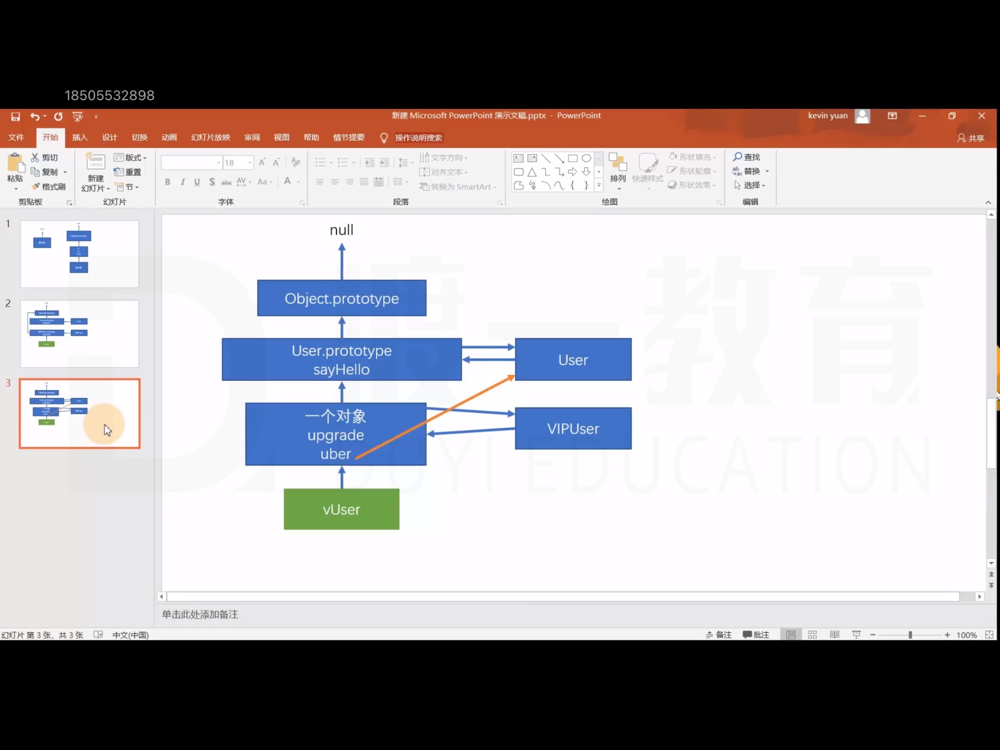

# 属性描述符

属性描述符的配置参考：https://developer.mozilla.org/zh-CN/docs/Web/JavaScript/Reference/Global_Objects/Object/defineProperty

属性描述符：它表达了一个属性的相关信息（元数据），他本质上是一个对象

1. 数据属性
   
2. 存取器属性

    - 当给它赋值，会自动运行set函数

    - 当获取它的值，会自动运行get函数
  
```js
Object.defineProperty(对象,对象的某个属性，{
    描述符对象
})
```

```js
        var obj = {
            a:1,
            b:2
        }
        Object.defineProperty(obj,'c',{
            set:function(){ 
                console.log('set运行');
            },
            get:function(val){
                console.log('get运行')
            }
        })
        console.log(obj.c);//get运行  undefined
        console.log(obj.c = 2)//set运行  2
```

其他属性参考网站


``Object.getOwnPropertyDescriptor()``：获取某个对象的某个属性属性描述符对象（该属性必须直接属于该对象，不能说原型链上的属性）


# 执行上下文

执行上下文：一个函数运行之前，创建的一块没内存空间，空间中包含该函数执行所需的数据，为该函数执行提供支持

执行上下文堆栈：call stack，所有执行上下文组成的内存空间

栈：一种数据结构，先进后出

全局执行上下文：所有JS代码执行之前，都必须有该环境

JS引擎始终执行的是栈顶的上下文

## 执行上下文中的内容

1. this指向

- 直接调用函数，this指向全局对象

- 在函数外，this指向全局对象

- 通过对象调用或new一个函数，this指向调用的对象或新对象

2. VO 变量对象

variable Object：VO中记录了该环境中所有声明的参数、变量和函数

Global Object：GO，全局执行上下文中的VO

Active：AO，当前正在执行的上下文中的VO

1). 确定形参值以及特殊变量argument

2). 确定函数中，通过var声明的变量，将他们的值设为undefined，如果VO已有该名称，则直接忽略

3). 确定函数中通过字面量声明的函数，将它们的值设置为指向函数对象，如果VO中已存在该名称，则覆盖

```js
        function A(a,b){
            console.log(a,b);//1 func
            var b =123;
            function b (){}
            var a =function(){}
            console.log(a,b);//func 123
        }
        A(1,2);
```

当一个上下文中的代码运行时，如果上下文中不存在某个属性，则会从上一个上下文寻找

# 作用域链

1. VO中包含一个额外的属性，该属性指向创建该VO的函数本身

2. 每个函数在创建时，会有一个隐藏属性``[[scope]]``，它指向创建该函数时的AO

3. 当访问一个变量时，会先查找自身VO中是否存在，如果不存在，则依次查找``[[scope]]``属性

```js
    var g = 0;
    function A() {
        var a = 1;
        function B() {
            var b = 2;
            var C = function () {
                var c = 3;
                console.log(g, a, b, c)//0,1,2,3
            }
            C();
        }
        B();
    }
    A();
```

```js
    function A(){
        var count=0;
        return function(){
            count++;
            console.log(count);
        }
    }
    var test = A();
    test();//1
    test();//2
    test();//3
```

某些浏览器会优化作用域链，函数的``[[scope]]``中仅保留需要用到的数据

```js
        for(var i = 0;i<10;i++){
            (function(i){
                setTimeout(() => {
                    console.log(i);//立即执行函数形成闭包结构，将每一次的i保存下来，0,1,2,3,4,5,6,7,8,9
                }, 1000);
            }(i))
        }
```

# 事件循环

异步：某些函数不会立即执行，需要等到某个时机成熟后才能执行，该函数叫做异步函数

浏览器的线程：

1. JS执行引擎：负责执行JS代码

2. 渲染线程：负责渲染页面

3. 计时器线程：负责计时

4. 事件监听线程：负责监听事件

5. http网络线程：负责网络通信

事件队列：一块内存空间，用于存放执行时机到达的异步函数，当JS引擎空闲时（执行栈没有可执行的上下文），它会从事件队列中拿出第一个函数执行

事件循环：event loop，是指函数在执行栈、宿主线程、事件队列中的循环移动 


# 函数防抖

防止短时间内多次触发

```js
//判断是否存在myPlugin，防止重复
if (!this.myPlugin) {
    this.myPlugin = {};
}

/**
 * 函数防抖函数
 */
this.myPlugin.debounce =  function(callback,time){
    var timer;
    //高阶函数：在函数内部返回一个新的函数，可防止全局变量污染
    return function(){
        clearTimeout(timer);
        //保存当前的传入参数，供下一个函数使用
        var args =arguments;
        timer = setTimeout(() => {
            //调用回调函数，并传入之前保存的参数
            callback.apply(null,args);
        }, time);
    }
}

        //将要传入的函数保存进变量
        var fnc =function(width){
            console.log(width);
        }
        //调用myPlugin.debounce，传入参数，返回一个函数，用handle变量保存
        var handle = myPlugin.debounce(fnc,1000)
        // handle(123)
        window.onresize =function(){
            //调用handle函数，并传入参数
            handle(document.documentElement.clientWidth);
        }
```

# 函数节流

保证一个时间段内只执行一次

```js
//判断是否存在myPlugin，防止重复
if (!this.myPlugin) {
    this.myPlugin = {};
}


/**
 * 函数节流函数
 */
this.myPlugin.throttle = function (callback, time, immediately) {
    // 第三个参数immediately,boolean类型，判断是否是立即触发，还是time时间后再触发
    //判断immediately是否传人，若没有，默认值为true
    if (immediately === undefined) {
        immediately = true;
    }
    //判断节流方式
    if (!immediately) {
        //保存时间的变量
        var t;
        return function () {
            //判断  之前是否计时  或  之前的时间与现在的时间差值是否大于time
            if (!t || Date.now() - t >= time) {
                callback.apply(null, arguments);
                //获取当前时间戳
                t = new Date();
            }
        }
    } else {
        var timer;
        //高阶函数：在函数内部返回一个新的函数，可防止全局变量污染
        return function () {
            if (timer) {
                return;
            }
            //保存当前的传入参数，供下一个函数使用
            var args = arguments;
            timer = setTimeout(() => {
                //调用回调函数，并传入之前保存的参数
                callback.apply(null, args);
                //将timer设为null，防止下次调用节流函数无法使用
                timer = null;
            }, time);
        }
    }
}


var btn =document.querySelector('button');
//将要传入的函数保存进变量
var fnc=function(val){
        console.log(1,val);
}
//调用myPlugin.throttle，传入参数，返回一个函数，用handle变量保存
var handle = myPlugin.throttle(fnc,1000,false)
btn.onclick =function(){
    //调用handle函数，并传入参数
    handle(this)
}
```

# 函数科里化

科里化函数：固定某个函数的一些参数，得到该函数剩余参数的一个新函数，如果没有参数，则调用


```js
//判断是否存在myPlugin，防止重复
if (!this.myPlugin) {
    this.myPlugin = {};
}


/**
 * 科里化函数
 * 在函数式编程中，科里化最重要的作用是把多参函数变为单参函数
 */
this.myPlugin.curry = function (fnc) {
    //得到从下表1开始的参数，下标0的参数为传入原始函数
    var args = Array.prototype.slice.call(arguments, 1);
    //保存当前this指向
    var that = this;
    return function () {
        //当前调用的参数
        var curArgs = Array.from(arguments);
        //全部参数
        var totalArgs = args.concat(curArgs);
        if (totalArgs.length >= fnc.length) {
            //参数数量够了
            return fnc.apply(null, totalArgs);
        } else {
            //参数数量仍然不够
            //unshift方法:在数组前面加上一项
            totalArgs.unshift(fnc);
            return that.curry.apply(that, totalArgs);
        }
    }
}


function add(a, b, c) {
    return (a + b) * c;
}
console.log(add(1, 2, 3));//9
console.log(add(1, 5, 5));//30
var g = myPlugin.curry(add, 1);
console.log(g(2, 3))//9
console.log(g(5, 5))//30
```

# 函数管道

函数管道：将多个单参函数组合起来，形成一个新的函数，前一个函数的输出，是后一个函数的输入

可与科里化配合使用

```js
//判断是否存在myPlugin，防止重复
if (!this.myPlugin) {
    this.myPlugin = {};
}


/**
 * 函数管道
 */
this.myPlugin.pipe = function(){
    var args =Array.from(arguments);
    return function(val){

        //写法一
        // return args.reduce(function(result,func){
        //     return func(result);
        // },val)


        //写法二
        //循环遍历参数
        for(var i= 0;i<args.length;i++){
            //保存参数中的函数
            var func = args[i];
            //执行参数中的函数，将得到的返回值重新存到val中，供下一个函数调用
            val =func(val);
        }
        //返回最终的val
        return val;
    }
}


//将字符串中每一个单词首字母大写
function everyLetterUp(str) {
    return str.replace(/\b(\w)(\w*)\b/g, function ($, $1, $2) {
        return $1.toUpperCase() + $2;
    })
}
//将字符串中除首字母外的其他字母小写
function otherLetterlower(str) {
    return str.replace(/\b(\w)(\w*)\b/g, function ($, $1, $2) {
        return $1 + $2.toLowerCase();
    })
}

//去掉所有的空白字符
function removeEmpty(str) {
    return str.replace(/\s+/g, '');
}

//首字母变小写
function firstLetterLower(str) {
    return str.replace(/\w/, function ($) {
        return $.toLowerCase();
    })
}
var str = ' my first friend';
var smallCamel = myPlugin.pipe(everyLetterUp, otherLetterlower, removeEmpty, firstLetterLower);
console.log(smallCamel(str))
```


